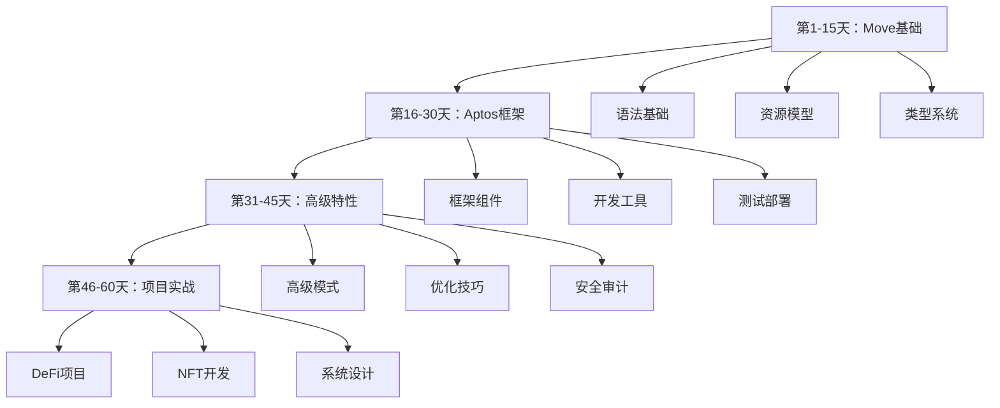
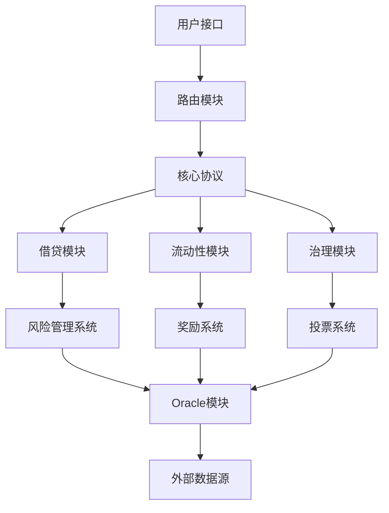

# Aptos Move 60天中级开发学习计划

## 学习目标

完成本计划后，您将达到Aptos Move中级开发水平，能够：
- 独立开发和部署复杂的Move智能合约
- 理解Aptos框架的核心组件和设计模式
- 掌握安全编程和性能优化技巧
- 具备DeFi、NFT等DApp开发能力

## 学习路径总览



---

## 第一阶段：Move语言基础 (第1-15天)

### 第1天：环境搭建和Hello World
**学习目标**：搭建开发环境，编写第一个Move程序

**理论任务**：
- [ ] 了解Move语言历史和设计理念
- [ ] 学习Move在Aptos生态系统中的地位
- [ ] 理解Move与其他智能合约语言的差异

**实践任务**：
- [ ] 安装Aptos CLI工具
- [ ] 配置VS Code Move扩展
- [ ] 创建第一个Move模块
- [ ] 编写并部署Hello World合约

**代码示例**：
```move
module hello_world::message {
    use std::string;

    public struct Message has key, store {
        content: string::String,
    }

    public fun create_message(content: string::String): Message {
        Message { content }
    }
}
```

**资源**：
- [Aptos CLI安装指南](https://aptos.dev/en/tools/cli)
- [Move语言简介](https://move-book.com/)

---

### 第2天：Move基本语法
**学习目标**：掌握Move的基本语法结构

**理论任务**：
- [ ] 学习Move模块和函数定义
- [ ] 理解变量声明和赋值
- [ ] 掌握基本数据类型
- [ ] 了解控制流语句

**实践任务**：
- [ ] 编写包含多种函数的模块
- [ ] 实现基本的数据操作函数
- [ ] 练习条件语句和循环
- [ ] 创建简单的计算器合约

**代码示例**：
```move
module calculator::math {
    public fun add(a: u64, b: u64): u64 {
        a + b
    }

    public fun factorial(n: u64): u64 {
        if (n <= 1) 1
        else n * factorial(n - 1)
    }

    public fun is_even(n: u64): bool {
        n % 2 == 0
    }
}
```

---

### 第3天：函数和模块系统
**学习目标**：深入理解Move的函数和模块系统

**理论任务**：
- [ ] 学习函数的可见性控制
- [ ] 理解模块的导入和导出
- [ ] 掌握函数参数和返回值
- [ ] 了解模块的命名规范

**实践任务**：
- [ ] 创建多模块项目结构
- [ ] 实现模块间的函数调用
- [ ] 练习私有和公共函数设计
- [ ] 编写模块化的工具库

**代码示例**：
```move
module utils::helpers {
    // 私有辅助函数
    fun validate_input(value: u64): bool {
        value > 0
    }

    // 公共API函数
    public fun safe_divide(a: u64, b: u64): Option<u64> {
        if (validate_input(b)) {
            option::some(a / b)
        } else {
            option::none()
        }
    }
}
```

---

### 第4天：基本数据类型深入
**学习目标**：掌握Move的各种数据类型

**理论任务**：
- [ ] 学习整数类型(u8, u16, u32, u64, u128, u256)
- [ ] 理解布尔类型和操作
- [ ] 掌握地址类型和签名者
- [ ] 了解向量和字符串类型

**实践任务**：
- [ ] 实现不同数据类型的转换函数
- [ ] 创建类型安全的数学运算库
- [ ] 练习地址和签名者操作
- [ ] 编写字符串处理工具

**代码示例**：
```move
module types::examples {
    public struct UserProfile has key, store {
        id: u64,
        balance: u128,
        is_active: bool,
        owner: address,
        name: string::String,
        tags: vector<string::String>,
    }

    public fun create_profile(
        owner: address,
        name: string::String
    ): UserProfile {
        UserProfile {
            id: 1,
            balance: 0,
            is_active: true,
            owner,
            name,
            tags: vector::empty(),
        }
    }
}
```

---

### 第5天：向量操作和集合
**学习目标**：熟练使用Move的向量和集合操作

**理论任务**：
- [ ] 学习向量的创建和操作
- [ ] 理解向量的内存管理
- [ ] 掌握向量遍历和搜索
- [ ] 了解向量性能考虑

**实践任务**：
- [ ] 实现向量工具函数库
- [ ] 创建动态数组管理器
- [ ] 练习向量排序和过滤
- [ ] 编写向量性能测试

**代码示例**：
```move
module collections::vector_utils {
    use std::vector;

    public fun sum(numbers: &vector<u64>): u64 {
        let i = 0;
        let total = 0;
        while (i < vector::length(numbers)) {
            total = total + *vector::borrow(numbers, i);
            i = i + 1;
        };
        total
    }

    public fun filter_even(numbers: &vector<u64>): vector<u64> {
        let result = vector::empty<u64>();
        let i = 0;
        while (i < vector::length(numbers)) {
            let num = *vector::borrow(numbers, i);
            if (num % 2 == 0) {
                vector::push_back(&mut result, num);
            };
            i = i + 1;
        };
        result
    }
}
```

---

### 第6天：引用和借用
**学习目标**：理解Move的引用系统和借用机制

**理论任务**：
- [ ] 学习不可变引用(&)和可变引用(&mut)
- [ ] 理解引用的生命周期
- [ ] 掌握借用检查器规则
- [ ] 了解引用的性能优势

**实践任务**：
- [ ] 实现引用传递的函数
- [ ] 练习可变和不可变引用
- [ ] 创建引用操作工具
- [ ] 编写引用安全检查

**代码示例**：
```move
module references::examples {
    public struct Counter has key, store {
        value: u64,
    }

    // 不可变引用读取
    public fun get_value(counter: &Counter): u64 {
        counter.value
    }

    // 可变引用修改
    public fun increment(counter: &mut Counter) {
        counter.value = counter.value + 1;
    }

    // 引用传递
    public fun add_to_counter(counter: &mut Counter, amount: u64) {
        counter.value = counter.value + amount;
    }
}
```

---

### 第7天：错误处理和调试
**学习目标**：掌握Move的错误处理机制和调试技巧

**理论任务**：
- [ ] 学习abort和assert语句
- [ ] 理解错误码的使用
- [ ] 掌握异常处理模式
- [ ] 了解调试工具和方法

**实践任务**：
- [ ] 实现带错误检查的函数
- [ ] 创建自定义错误码系统
- [ ] 练习调试技巧
- [ ] 编写错误处理测试

**代码示例**：
```move
module error_handling::safe_math {
    const E_DIVISION_BY_ZERO: u64 = 1;
    const E_OVERFLOW: u64 = 2;

    public fun safe_divide(a: u64, b: u64): u64 {
        assert!(b != 0, E_DIVISION_BY_ZERO);
        a / b
    }

    public fun safe_add(a: u64, b: u64): u64 {
        let result = a + b;
        assert!(result >= a, E_OVERFLOW);
        result
    }

    public fun is_error_occurred(error_code: u64): bool {
        error_code != 0
    }
}
```

---

### 第8天：Resource基础概念
**学习目标**：理解Move的核心创新：Resource模型

**理论任务**：
- [ ] 学习Resource的概念和重要性
- [ ] 理解Resource的所有权规则
- [ ] 掌握Resource的四种能力
- [ ] 了解Resource的线性类型特性

**实践任务**：
- [ ] 创建第一个Resource结构体
- [ ] 实现Resource的转移函数
- [ ] 练习Resource的创建和销毁
- [ ] 编写Resource操作测试

**代码示例**：
```move
module resources::asset {
    public struct Coin has key, store {
        value: u64,
    }

    public fun mint_coin(value: u64): Coin {
        Coin { value }
    }

    public fun get_balance(coin: &Coin): u64 {
        coin.value
    }

    public fun merge(mut coin1: Coin, coin2: Coin) {
        coin1.value = coin1.value + coin2.value;
        // coin2在这里被自动销毁
    }
}
```

---

### 第9天：Resource所有权和转移
**学习目标**：深入理解Resource的所有权机制

**理论任务**：
- [ ] 学习Resource的所有权转移
- [ ] 理解move语义和复制语义
- [ ] 掌握Resource的存储和检索
- [ ] 了解Resource的生命周期

**实践任务**：
- [ ] 实现Resource转移函数
- [ ] 创建所有权管理系统
- [ ] 练习Resource存储操作
- [ ] 编写所有权验证测试

**代码示例**：
```move
module ownership::token {
    public struct Token has key, store {
        id: u64,
        owner: address,
    }

    public fun create_token(id: u64, owner: address): Token {
        Token { id, owner }
    }

    public fun transfer_token(token: Token, to: address): Token {
        Token { id: token.id, owner: to }
    }

    public fun is_owner(token: &Token, account: address): bool {
        token.owner == account
    }
}
```

---

### 第10天：Resource存储和访问控制
**学习目标**：掌握Resource的存储机制和访问控制

**理论任务**：
- [ ] 学习Resource的存储模式
- [ ] 理解全局存储操作
- [ ] 掌握访问控制机制
- [ ] 了解存储权限管理

**实践任务**：
- [ ] 实现Resource存储函数
- [ ] 创建访问控制系统
- [ ] 练习全局存储操作
- [ ] 编写权限验证测试

**代码示例**：
```move
module storage::vault {
    use std::signer;

    public struct Vault has key {
        balance: u64,
        owner: address,
    }

    public fun create_vault(account: &signer) {
        let owner = signer::address_of(account);
        move_to(account, Vault {
            balance: 0,
            owner,
        });
    }

    public fun deposit(account: &signer, amount: u64) acquires Vault {
        let vault = borrow_global_mut<Vault>(signer::address_of(account));
        vault.balance = vault.balance + amount;
    }

    public fun get_balance(addr: address): u64 acquires Vault {
        borrow_global<Vault>(addr).balance
    }
}
```

---

### 第11天：能力(Abilities)系统
**学习目标**：深入理解Move的能力系统

**理论任务**：
- [ ] 学习四种基本能力：copy, drop, store, key
- [ ] 理解能力的组合使用
- [ ] 掌握能力的约束和限制
- [ ] 了解能力的设计原理

**实践任务**：
- [ ] 创建不同能力的结构体
- [ ] 实现能力约束的函数
- [ ] 练习能力组合使用
- [ ] 编写能力验证测试

**代码示例**：
```move
module abilities::examples {
    // 只有copy能力，可以复制但不能存储
    public struct Config has copy, drop {
        max_supply: u64,
    }

    // 只有store能力，可以存储但不能复制
    public struct UniqueItem has store, key {
        id: u64,
        metadata: string::String,
    }

    // 具有所有能力
    public struct FlexibleToken has copy, drop, store, key {
        value: u64,
        owner: address,
    }
}
```

---

### 第12天：泛型编程
**学习目标**：掌握Move的泛型编程技巧

**理论任务**：
- [ ] 学习泛型类型参数
- [ ] 理解泛型约束
- [ ] 掌握泛型函数实现
- [ ] 了解泛型的性能考虑

**实践任务**：
- [ ] 实现泛型数据结构
- [ ] 创建泛型工具函数
- [ ] 练习泛型约束使用
- [ ] 编写泛型性能测试

**代码示例**：
```move
module generics::collections {
    public struct Box<T> has store, drop {
        value: T,
    }

    public struct Pair<T1, T2> has store, drop {
        first: T1,
        second: T2,
    }

    public fun create_box<T>(value: T): Box<T> {
        Box { value }
    }

    public fun get_from_box<T>(box: &Box<T>): &T {
        &box.value
    }

    public fun create_pair<T1, T2>(first: T1, second: T2): Pair<T1, T2> {
        Pair { first, second }
    }
}
```

---

### 第13天：标准库深入
**学习目标**：熟悉Move标准库的核心组件

**理论任务**：
- [ ] 学习std::vector模块
- [ ] 理解std::option和std::result
- [ ] 掌握std::signer和std::account
- [ ] 了解std::event和std::timestamp

**实践任务**：
- [ ] 使用标准库重写之前的项目
- [ ] 创建基于标准库的工具函数
- [ ] 练习标准库的高级用法
- [ ] 编写标准库性能对比

**代码示例**：
```move
module stdlib_examples::advanced {
    use std::option::{Self, Option};
    use std::vector;
    use std::signer;
    use std::event;

    public struct EventHandle has drop, store {
        count: u64,
    }

    public struct DepositEvent has drop, store {
        amount: u64,
        account: address,
    }

    public fun safe_operation(value: u64): Option<u64> {
        if (value > 100) {
            option::some(value * 2)
        } else {
            option::none()
        }
    }

    public fun emit_event(account: &signer, amount: u64) {
        let account_addr = signer::address_of(account);
        event::emit(DepositEvent { amount, account: account_addr });
    }
}
```

---

### 第14天：测试框架使用
**学习目标**：掌握Move的测试框架和测试技巧

**理论任务**：
- [ ] 学习Move测试语法
- [ ] 理解单元测试和集成测试
- [ ] 掌握测试数据和Mock
- [ ] 了解测试覆盖率分析

**实践任务**：
- [ ] 为之前的项目编写测试
- [ ] 创建测试工具函数
- [ ] 练习测试驱动开发
- [ ] 编写性能基准测试

**代码示例**：
```move
#[test_only]
module testing::examples {
    use std::vector;

    #[test]
    fun test_vector_operations() {
        let v = vector::empty<u64>();
        vector::push_back(&mut v, 1);
        vector::push_back(&mut v, 2);
        vector::push_back(&mut v, 3);
        
        assert!(vector::length(&v) == 3, 1);
        assert!(*vector::borrow(&v, 0) == 1, 2);
        assert!(*vector::borrow(&v, 2) == 3, 3);
    }

    #[test]
    #[expected_failure(abort_code = 1)]
    fun test_error_handling() {
        // 这个测试预期会失败
        abort 1
    }
}
```

---

### 第15天：第一阶段项目实战
**学习目标**：综合运用前14天知识完成一个完整项目

**项目要求**：
- 创建一个简单的代币合约
- 实现代币的铸造、转移和销毁
- 包含完整的测试套件
- 添加适当的错误处理

**项目结构**：
```
token_project/
├── sources/
│   └── token/
│       ├── token.move
│       └── tests/
│           └── token_tests.move
└── Move.toml
```

**核心功能**：
- [ ] 代币结构体定义
- [ ] 铸造函数实现
- [ ] 转移函数实现
- [ ] 余额查询功能
- [ ] 销毁功能实现
- [ ] 完整测试套件

**评估标准**：
- 代码质量和结构
- 功能完整性
- 测试覆盖率
- 错误处理
- 文档完整性

---

## 第二阶段：Aptos框架深入 (第16-30天)

### 第16天：Aptos框架概述
**学习目标**：了解Aptos框架的整体架构和核心组件

**理论任务**：
- [ ] 学习Aptos框架的设计理念
- [ ] 理解框架模块的组织结构
- [ ] 掌握核心组件的功能
- [ ] 了解框架与标准库的关系

**实践任务**：
- [ ] 探索Aptos框架源码结构
- [ ] 分析核心模块的接口设计
- [ ] 创建基于框架的Hello World
- [ ] 练习框架模块的导入使用

**代码示例**：
```move
module framework_intro::example {
    use aptos_framework::account;
    use aptos_framework::coin;
    use aptos_framework::timestamp;

    public fun get_current_time(): u64 {
        timestamp::now_seconds()
    }

    public fun create_account_if_not_exists(addr: address) {
        if (!account::exists_at(addr)) {
            account::create_account(addr);
        }
    }
}
```

---

### 第17天：账户管理模块
**学习目标**：掌握Aptos账户管理系统的使用

**理论任务**：
- [ ] 学习aptos_framework::account模块
- [ ] 理解账户创建和管理
- [ ] 掌握账户权限控制
- [ ] 了解账户状态管理

**实践任务**：
- [ ] 实现账户创建功能
- [ ] 创建账户权限检查
- [ ] 练习账户状态查询
- [ ] 编写账户管理测试

**代码示例**：
```move
module account_management::wallet {
    use aptos_framework::account;
    use aptos_framework::signer;

    public struct Wallet has key {
        balance: u64,
        owner: address,
    }

    public fun create_wallet(account: &signer) {
        let owner = signer::address_of(account);
        assert!(account::exists_at(owner), 1);
        move_to(account, Wallet {
            balance: 0,
            owner,
        });
    }

    public fun get_balance(addr: address): u64 acquires Wallet {
        assert!(account::exists_at(addr), 2);
        borrow_global<Wallet>(addr).balance
    }
}
```

---

### 第18天：Coin框架深入
**学习目标**：深入理解Aptos的Coin框架和代币标准

**理论任务**：
- [ ] 学习aptos_framework::coin模块
- [ ] 理解Coin的设计模式
- [ ] 掌握代币的标准接口
- [ ] 了解代币的安全考虑

**实践任务**：
- [ ] 创建自定义代币
- [ ] 实现代币的铸造和销毁
- [ ] 练习代币转移功能
- [ ] 编写代币安全测试

**代码示例**：
```move
module custom_token::my_coin {
    use aptos_framework::coin;

    public struct MyCoin {}

    public fun initialize(
        treasury: &signer,
        decimals: u8,
    ) {
        coin::initialize<MyCoin>(
            treasury,
            b"MyCoin",
            b"MC",
            decimals,
            true,
        );
    }

    public fun mint(treasury: &signer, to: address, amount: u64) {
        coin::mint<MyCoin>(treasury, amount);
        coin::transfer<MyCoin>(treasury, to, amount);
    }
}
```

---

### 第19天：对象模型(Object Model)
**学习目标**：掌握Aptos的对象模型和对象操作

**理论任务**：
- [ ] 学习Aptos对象模型概念
- [ ] 理解对象的创建和管理
- [ ] 掌握对象的转移和共享
- [ ] 了解对象的生命周期

**实践任务**：
- [ ] 创建自定义对象类型
- [ ] 实现对象操作函数
- [ ] 练习对象转移机制
- [ ] 编写对象管理测试

**代码示例**：
```move
module object_model::nft {
    use aptos_framework::object::{Self, Object};
    use std::string;

    public struct NFT has key {
        name: string::String,
        creator: address,
        metadata: string::String,
    }

    public fun create_nft(
        creator: &signer,
        name: string::String,
        metadata: string::String,
    ): Object<NFT> {
        let nft = NFT {
            name,
            creator: signer::address_of(creator),
            metadata,
        };
        object::create_object(&signer::address_of(creator), nft)
    }

    public fun transfer_nft(
        nft: Object<NFT>,
        to: address,
    ) {
        object::transfer(nft, to);
    }
}
```

---

### 第20天：事件系统
**学习目标**：掌握Aptos的事件发布和处理机制

**理论任务**：
- [ ] 学习aptos_framework::event模块
- [ ] 理解事件的设计模式
- [ ] 掌握事件的发布和监听
- [ ] 了解事件的存储和查询

**实践任务**：
- [ ] 定义自定义事件类型
- [ ] 实现事件发布功能
- [ ] 练习事件处理逻辑
- [ ] 编写事件测试用例

**代码示例**：
```move
module event_system::trading {
    use aptos_framework::event;
    use std::signer;

    public struct TradeEvent has drop, store {
        from: address,
        to: address,
        token_id: u64,
        amount: u64,
        timestamp: u64,
    }

    public struct EventHandle has key {
        trade_events: event::EventHandle<TradeEvent>,
    }

    public fun emit_trade_event(
        account: &signer,
        from: address,
        to: address,
        token_id: u64,
        amount: u64,
    ) acquires EventHandle {
        let handle = &mut borrow_global_mut<EventHandle>(
            signer::address_of(account)
        ).trade_events;
        
        event::emit_event(
            handle,
            TradeEvent {
                from,
                to,
                token_id,
                amount,
                timestamp: aptos_framework::timestamp::now_seconds(),
            },
        );
    }
}
```

---

### 第21天：时间戳和随机数
**学习目标**：学习Aptos的时间戳和随机数生成机制

**理论任务**：
- [ ] 学习aptos_framework::timestamp模块
- [ ] 理解时间戳的使用场景
- [ ] 掌握随机数生成方法
- [ ] 了解时间相关的安全考虑

**实践任务**：
- [ ] 实现时间戳相关功能
- [ ] 创建基于时间的逻辑
- [ ] 练习随机数使用
- [ ] 编写时间安全测试

**代码示例**：
```move
module time_random::lottery {
    use aptos_framework::timestamp;
    use std::vector;

    public struct Lottery has key {
        participants: vector<address>,
        end_time: u64,
        is_finished: bool,
    }

    public fun create_lottery(
        creator: &signer,
        duration_seconds: u64,
    ): Lottery {
        Lottery {
            participants: vector::empty(),
            end_time: timestamp::now_seconds() + duration_seconds,
            is_finished: false,
        }
    }

    public fun is_lottery_finished(lottery: &Lottery): bool {
        timestamp::now_seconds() >= lottery.end_time
    }

    public fun select_winner(lottery: &Lottery): address {
        let seed = timestamp::now_microseconds();
        let index = (seed as u64) % vector::length(&lottery.participants);
        *vector::borrow(&lottery.participants, index)
    }
}
```

---

### 第22天：权限管理和访问控制
**学习目标**：深入理解Aptos的权限管理和访问控制机制

**理论任务**：
- [ ] 学习权限管理的设计模式
- [ ] 理解角色基础的访问控制
- [ ] 掌握权限检查和验证
- [ ] 了解权限升级和降级

**实践任务**：
- [ ] 实现权限管理系统
- [ ] 创建角色定义函数
- [ ] 练习权限检查逻辑
- [ ] 编写权限安全测试

**代码示例**：
```move
module access_control::admin {
    use std::signer;

    public struct AdminCapability has key, store {
        owner: address,
    }

    public struct Role has key, store {
        name: string::String,
        permissions: vector<string::String>,
    }

    public fun grant_admin_capability(
        account: &signer,
        admin_address: address,
    ) {
        move_to(account, AdminCapability {
            owner: admin_address,
        });
    }

    public fun is_admin(addr: address): bool acquires AdminCapability {
        exists<AdminCapability>(addr) && 
        borrow_global<AdminCapability>(addr).owner == addr
    }

    public fun require_admin(addr: address) acquires AdminCapability {
        assert!(is_admin(addr), 1); // E_NOT_ADMIN
    }
}
```

---

### 第23天：Aptos CLI高级用法
**学习目标**：掌握Aptos CLI的高级功能和最佳实践

**理论任务**：
- [ ] 学习CLI的高级命令
- [ ] 理解配置文件管理
- [ ] 掌握多环境部署
- [ ] 了解CLI自动化脚本

**实践任务**：
- [ ] 配置多环境CLI设置
- [ ] 创建自动化部署脚本
- [ ] 练习CLI高级命令
- [ ] 编写CLI工具测试

**命令示例**：
```bash
# 初始化项目
aptos init --network testnet

# 编译项目
aptos move compile

# 发布合约
aptos move publish --profile default

# 运行测试
aptos move test

# 查看资源
aptos account list-resources --account <address>

# 调用函数
aptos move run --function-id <address>::module::function --args <args>
```

---

### 第24天：测试网和主网部署
**学习目标**：掌握在测试网和主网部署合约的流程

**理论任务**：
- [ ] 学习Aptos网络架构
- [ ] 理解测试网和主网差异
- [ ] 掌握部署流程和注意事项
- [ ] 了解网络监控和调试

**实践任务**：
- [ ] 配置测试网环境
- [ ] 部署合约到测试网
- [ ] 验证合约功能
- [ ] 准备主网部署检查清单

**部署流程**：
```bash
# 1. 配置网络
aptos config set-global --network testnet

# 2. 创建账户
aptos account create

# 3. 获取测试币
aptos account fund-with-faucet --account <address>

# 4. 发布合约
aptos move publish --profile default

# 5. 验证部署
aptos account list-resources --account <address>
```

---

### 第25天：Gas优化基础
**学习目标**：理解Aptos的Gas机制和基础优化技巧

**理论任务**：
- [ ] 学习Gas计算原理
- [ ] 理解Gas费用结构
- [ ] 掌握基础优化策略
- [ ] 了解Gas监控工具

**实践任务**：
- [ ] 分析合约Gas消耗
- [ ] 实现基础优化技巧
- [ ] 创建Gas测试基准
- [ ] 编写优化指南

**优化技巧**：
```move
module gas_optimization::efficient {
    // 使用引用避免复制
    public fun efficient_sum(numbers: &vector<u64>): u64 {
        let i = 0;
        let total = 0;
        let len = vector::length(numbers); // 缓存长度
        while (i < len) {
            total = total + *vector::borrow(numbers, i);
            i = i + 1;
        };
        total
    }

    // 批量操作减少交易次数
    public fun batch_transfer(
        from: &signer,
        recipients: vector<address>,
        amounts: vector<u64>,
    ) {
        let i = 0;
        while (i < vector::length(&recipients)) {
            // 批量转移逻辑
            i = i + 1;
        };
    }
}
```

---

### 第26天：调试和日志记录
**学习目标**：掌握Move合约的调试技巧和日志记录方法

**理论任务**：
- [ ] 学习Move调试工具
- [ ] 理解日志记录最佳实践
- [ ] 掌握错误追踪方法
- [ ] 了解性能分析工具

**实践任务**：
- [ ] 设置调试环境
- [ ] 实现日志记录系统
- [ ] 练习调试技巧
- [ ] 编写调试工具

**调试示例**：
```move
module debugging::logger {
    use aptos_framework::event;

    public struct DebugEvent has drop, store {
        message: string::String,
        data: vector<u8>,
        timestamp: u64,
    }

    public struct Logger has key {
        debug_events: event::EventHandle<DebugEvent>,
    }

    public fun log_debug(
        account: &signer,
        message: string::String,
        data: vector<u8>,
    ) acquires Logger {
        let handle = &mut borrow_global_mut<Logger>(
            signer::address_of(account)
        ).debug_events;
        
        event::emit_event(
            handle,
            DebugEvent {
                message,
                data,
                timestamp: aptos_framework::timestamp::now_microseconds(),
            },
        );
    }
}
```

---

### 第27天：版本管理和升级
**学习目标**：理解Move合约的版本管理和升级策略

**理论任务**：
- [ ] 学习合约版本控制
- [ ] 理解升级策略和模式
- [ ] 掌握数据迁移方法
- [ ] 了解向后兼容性考虑

**实践任务**：
- [ ] 设计版本管理系统
- [ ] 实现升级机制
- [ ] 练习数据迁移
- [ ] 编写升级测试

**版本管理示例**：
```move
module versioning::upgradeable {
    public struct ContractVersion has key, store {
        version: u64,
        upgrade_time: u64,
    }

    public struct V1Data has key, store {
        value: u64,
    }

    public struct V2Data has key, store {
        value: u64,
        metadata: string::String,
    }

    public fun upgrade_contract(
        account: &signer,
        new_version: u64,
    ) acquires ContractVersion, V1Data {
        let addr = signer::address_of(account);
        let version = borrow_global_mut<ContractVersion>(addr);
        version.version = new_version;
        version.upgrade_time = aptos_framework::timestamp::now_seconds();
        
        // 数据迁移逻辑
        if (exists<V1Data>(addr)) {
            let old_data = move_from<V1Data>(addr);
            move_to(account, V2Data {
                value: old_data.value,
                metadata: string::utf8(b"migrated"),
            });
        };
    }
}
```

---

### 第28天：跨模块交互
**学习目标**：掌握Move模块间的复杂交互模式

**理论任务**：
- [ ] 学习模块依赖管理
- [ ] 理解接口设计原则
- [ ] 掌握模块通信模式
- [ ] 了解循环依赖避免

**实践任务**：
- [ ] 设计模块接口
- [ ] 实现模块通信
- [ ] 练习依赖注入
- [ ] 编写集成测试

**跨模块示例**：
```move
// 接口模块
module interfaces::token {
    public trait Token has store {
        fn get_balance(token: &Self, addr: address): u64;
        fn transfer(token: &mut Self, from: address, to: address, amount: u64);
    }
}

// 实现模块
module implementations::my_token {
    use interfaces::token::Token;

    public struct MyToken has key, store {
        balances: vector<address>,
        values: vector<u64>,
    }

    public fun get_balance(token: &MyToken, addr: address): u64 {
        // 实现逻辑
        0
    }

    public fun transfer(token: &mut MyToken, from: address, to: address, amount: u64) {
        // 实现逻辑
    }
}
```

---

### 第29天：性能分析和优化
**学习目标**：深入理解Move合约的性能分析和高级优化技巧

**理论任务**：
- [ ] 学习性能分析工具
- [ ] 理解性能瓶颈识别
- [ ] 掌握高级优化策略
- [ ] 了解性能测试方法

**实践任务**：
- [ ] 进行性能基准测试
- [ ] 识别性能瓶颈
- [ ] 实现优化方案
- [ ] 验证优化效果

**性能优化示例**：
```move
module performance::optimized {
    use std::vector;

    // 优化前：多次向量操作
    public fun inefficient_operations(data: &mut vector<u64>) {
        vector::push_back(data, 1);
        vector::push_back(data, 2);
        vector::push_back(data, 3);
    }

    // 优化后：批量操作
    public fun efficient_operations(data: &mut vector<u64>) {
        let temp = vector[1, 2, 3];
        vector::append(data, temp);
    }

    // 内存优化：使用引用避免复制
    public fun process_large_data(
        data: &vector<vector<u64>>,
    ): u64 {
        let i = 0;
        let total = 0;
        let len = vector::length(data);
        while (i < len) {
            let inner_vec = vector::borrow(data, i);
            total = total + vector::length(inner_vec);
            i = i + 1;
        };
        total
    }
}
```

---

### 第30天：第二阶段项目实战
**学习目标**：综合运用Aptos框架知识完成一个DeFi项目

**项目要求**：
- 创建一个去中心化交易所(DEX)
- 实现流动性池管理
- 包含代币交换功能
- 添加流动性挖矿机制

**项目结构**：
```
defi_project/
├── sources/
│   ├── dex/
│   │   ├── swap.move
│   │   ├── liquidity_pool.move
│   │   └── farming.move
│   └── tests/
│       ├── integration_tests.move
│       └── performance_tests.move
└── Move.toml
```

**核心功能**：
- [ ] 流动性池创建和管理
- [ ] 代币交换算法实现
- [ ] 流动性提供者奖励
- [ ] 滑点保护机制
- [ ] 完整的测试套件
- [ ] Gas优化实现

**评估标准**：
- 代码架构设计
- 功能完整性
- 安全性考虑
- 性能优化
- 测试覆盖率
- 文档质量

---

## 第三阶段：高级特性和模式 (第31-45天)

### 第31天：高级泛型编程
**学习目标**：掌握Move的高级泛型编程技巧和模式

**理论任务**：
- [ ] 学习泛型约束的高级用法
- [ ] 理解泛型特化技术
- [ ] 掌握泛型性能优化
- [ ] 了解泛型的设计模式

**实践任务**：
- [ ] 实现复杂的泛型数据结构
- [ ] 创建泛型算法库
- [ ] 练习泛型约束使用
- [ ] 编写泛型性能测试

**代码示例**：
```move
module advanced_generics::collections {
    use std::vector;

    // 泛型约束示例
    public trait Comparable has copy, drop {
        fn compare(a: &Self, b: &Self): u8;
    }

    // 实现Comparable trait
    public struct U64Comparator {}
    impl U64Comparator: Comparable<u64> {
        fn compare(a: &u64, b: &u64): u8 {
            if (a < b) 0u8
            else if (a > b) 1u8
            else 2u8
        }
    }

    // 泛型排序函数
    public fun generic_sort<T: Comparable>(
        vec: &mut vector<T>
    ) {
        // 实现泛型排序算法
        let i = 0;
        let len = vector::length(vec);
        while (i < len - 1) {
            let j = i + 1;
            while (j < len) {
                let a = vector::borrow(vec, i);
                let b = vector::borrow(vec, j);
                if (Comparable::compare(a, b) == 1u8) {
                    vector::swap(vec, i, j);
                };
                j = j + 1;
            };
            i = i + 1;
        }
    }
}
```

---

### 第32天：高级资源管理
**学习目标**：深入理解Move的高级资源管理模式

**理论任务**：
- [ ] 学习资源的生命周期管理
- [ ] 理解资源的组合和分解
- [ ] 掌握资源的包装模式
- [ ] 了解资源的性能优化

**实践任务**：
- [ ] 实现复杂的资源管理系统
- [ ] 创建资源包装器
- [ ] 练习资源组合模式
- [ ] 编写资源安全测试

**代码示例**：
```move
module advanced_resources::wrapper {
    use std::option;

    // 资源包装器模式
    public struct ResourceWrapper<T: key + store> has key, store {
        resource: T,
        metadata: string::String,
        is_locked: bool,
    }

    // 可选资源包装器
    public struct OptionalResource<T: key + store> has key, store {
        resource: option::Option<T>,
    }

    public fun wrap_resource<T: key + store>(
        resource: T,
        metadata: string::String,
    ): ResourceWrapper<T> {
        ResourceWrapper {
            resource,
            metadata,
            is_locked: false,
        }
    }

    public fun unwrap_resource<T: key + store>(
        wrapper: ResourceWrapper<T>,
    ): T {
        assert!(!wrapper.is_locked, 1); // E_RESOURCE_LOCKED
        wrapper.resource
    }

    public fun lock_resource<T: key + store>(
        wrapper: &mut ResourceWrapper<T>
    ) {
        wrapper.is_locked = true;
    }
}
```

---

### 第33天：元编程和代码生成
**学习目标**：了解Move的元编程概念和代码生成技巧

**理论任务**：
- [ ] 学习Move的宏系统概念
- [ ] 理解代码生成模式
- [ ] 掌握模板化编程
- [ ] 了解编译时计算

**实践任务**：
- [ ] 实现代码生成工具
- [ ] 创建模板化合约
- [ ] 练习宏模式使用
- [ ] 编写生成代码测试

**代码示例**：
```move
module metaprogramming::factory {
    use std::signer;

    // 工厂模式实现
    public struct Factory has key {
        created_count: u64,
        templates: vector<string::String>,
    }

    public struct Product has key, store {
        id: u64,
        template_name: string::String,
        creator: address,
        data: vector<u8>,
    }

    public fun create_product(
        factory: &signer,
        template_name: string::String,
        data: vector<u8>,
    ): Product {
        let factory_addr = signer::address_of(factory);
        let factory_ref = borrow_global_mut<Factory>(factory_addr);
        
        let product_id = factory_ref.created_count;
        factory_ref.created_count = product_id + 1;
        
        Product {
            id: product_id,
            template_name,
            creator: factory_addr,
            data,
        }
    }

    // 批量创建产品
    public fun batch_create_products(
        factory: &signer,
        template_name: string::String,
        data_list: vector<vector<u8>>,
    ): vector<Product> {
        let i = 0;
        let products = vector::empty<Product>();
        let len = vector::length(&data_list);
        
        while (i < len) {
            let data = *vector::borrow(&data_list, i);
            let product = create_product(factory, template_name, data);
            vector::push_back(&mut products, product);
            i = i + 1;
        };
        
        products
    }
}
```

---

### 第34天：高级错误处理
**学习目标**：掌握Move的高级错误处理模式和恢复机制

**理论任务**：
- [ ] 学习错误恢复策略
- [ ] 理解错误传播机制
- [ ] 掌握错误分类和处理
- [ ] 了解错误监控和报告

**实践任务**：
- [ ] 实现高级错误处理系统
- [ ] 创建错误恢复机制
- [ ] 练习错误分类处理
- [ ] 编写错误处理测试

**代码示例**：
```move
module advanced_error::recovery {
    use std::option;

    // 错误类型定义
    public const E_INSUFFICIENT_BALANCE: u64 = 1001;
    public const E_INVALID_AMOUNT: u64 = 1002;
    public const E_UNAUTHORIZED: u64 = 1003;

    // 错误信息结构
    public struct ErrorInfo has drop, store {
        code: u64,
        message: string::String,
        timestamp: u64,
    }

    // 结果类型
    public struct Result<T: drop + store> has drop, store {
        value: option::Option<T>,
        error: option::Option<ErrorInfo>,
    }

    // 成功结果构造
    public fun success<T: drop + store>(value: T): Result<T> {
        Result {
            value: option::some(value),
            error: option::none(),
        }
    }

    // 错误结果构造
    public fun error<T: drop + store>(
        code: u64,
        message: string::String,
    ): Result<T> {
        Result {
            value: option::none(),
            error: option::some(ErrorInfo {
                code,
                message,
                timestamp: aptos_framework::timestamp::now_seconds(),
            }),
        }
    }

    // 安全除法操作
    public fun safe_divide(
        a: u64,
        b: u64,
    ): Result<u64> {
        if (b == 0) {
            error<u64>(E_INVALID_AMOUNT, string::utf8(b"Division by zero"))
        } else {
            success<u64>(a / b)
        }
    }

    // 错误恢复操作
    public fun recover_from_error<T: drop + store>(
        result: Result<T>,
        default_value: T,
    ): T {
        if (option::is_some(&result.value)) {
            *option::borrow(&result.value)
        } else {
            default_value
        }
    }
}
```

---

### 第35天：高级安全模式
**学习目标**：学习Move的高级安全编程模式和防护机制

**理论任务**：
- [ ] 学习重入攻击防护
- [ ] 理解整数溢出保护
- [ ] 掌握访问控制模式
- [ ] 了解审计追踪机制

**实践任务**：
- [ ] 实现安全防护机制
- [ ] 创建安全检查工具
- [ ] 练习安全模式应用
- [ ] 编写安全审计测试

**代码示例**：
```move
module security::patterns {
    use std::signer;

    // 重入攻击防护
    public struct ReentrancyGuard has key {
        locked: bool,
    }

    public fun acquire_guard(account: &signer) acquires ReentrancyGuard {
        let addr = signer::address_of(account);
        let guard = borrow_global_mut<ReentrancyGuard>(addr);
        assert!(!guard.locked, 1); // E_REENTRANCY
        guard.locked = true;
    }

    public fun release_guard(account: &signer) acquires ReentrancyGuard {
        let guard = borrow_global_mut<ReentrancyGuard>(signer::address_of(account));
        guard.locked = false;
    }

    // 整数溢出保护
    public struct SafeMath {}

    impl SafeMath {
        public fun safe_add(a: u64, b: u64): u64 {
            let result = a + b;
            assert!(result >= a, 2); // E_OVERFLOW
            result
        }

        public fun safe_mul(a: u64, b: u64): u64 {
            if (a == 0) return 0;
            let result = a * b;
            assert!(result / a == b, 2); // E_OVERFLOW
            result
        }
    }

    // 访问控制模式
    public struct RoleManager has key {
        admin_role: vector<address>,
        user_role: vector<address>,
    }

    public fun has_admin_role(
        role_manager: &RoleManager,
        addr: address,
    ): bool {
        vector::contains(&role_manager.admin_role, &addr)
    }

    public fun require_admin(
        role_manager: &RoleManager,
        addr: address,
    ) {
        assert!(has_admin_role(role_manager, addr), 3); // E_UNAUTHORIZED
    }
}
```

---

### 第36天：高级存储优化
**学习目标**：掌握Move的高级存储优化技巧和模式

**理论任务**：
- [ ] 学习存储布局优化
- [ ] 理解数据压缩技术
- [ ] 掌握缓存策略
- [ ] 了解存储成本分析

**实践任务**：
- [ ] 实现存储优化算法
- [ ] 创建数据压缩工具
- [ ] 练习缓存策略
- [ ] 编写存储性能测试

**代码示例**：
```move
module storage_optimization::advanced {
    use std::vector;

    // 紧凑存储结构
    public struct CompactStorage has key, store {
        // 使用位字段节省空间
        flags: u8,  // 8个布尔值
        small_values: vector<u8>,  // 小值存储
        large_values: vector<u64>,  // 大值存储
    }

    // 数据压缩存储
    public struct CompressedData has key, store {
        compressed: vector<u8>,
        original_size: u64,
        compression_type: u8,
    }

    // 分层存储
    public struct TieredStorage has key {
        hot_data: vector<u64>,      // 热数据
        cold_data: vector<u64>,     // 冷数据
        archive_data: vector<u64>,  // 归档数据
    }

    // 批量操作优化
    public fun batch_process(
        data: &mut vector<u64>,
        operations: vector<u8>,
    ) {
        let i = 0;
        let len = vector::length(&operations);
        
        while (i < len) {
            let op = *vector::borrow(&operations, i);
            match (op) {
                0 => {
                    // 批量插入操作
                    i = i + 1;
                    let count = *vector::borrow(&operations, i);
                    batch_insert(data, count);
                },
                1 => {
                    // 批量删除操作
                    i = i + 1;
                    let count = *vector::borrow(&operations, i);
                    batch_remove(data, count);
                },
                _ => abort 1, // E_INVALID_OPERATION
            };
            i = i + 1;
        }
    }

    fun batch_insert(data: &mut vector<u64>, count: u64) {
        let i = 0;
        while (i < count) {
            vector::push_back(data, i);
            i = i + 1;
        }
    }

    fun batch_remove(data: &mut vector<u64>, count: u64) {
        let i = 0;
        while (i < count && !vector::is_empty(data)) {
            vector::pop_back(data);
            i = i + 1;
        }
    }
}
```

---

### 第37天：高级并发模式
**学习目标**：理解Move的并发编程模式和原子操作

**理论任务**：
- [ ] 学习并发编程概念
- [ ] 理解原子操作原理
- [ ] 掌握锁机制设计
- [ ] 了解竞态条件防护

**实践任务**：
- [ ] 实现并发安全的数据结构
- [ ] 创建原子操作工具
- [ ] 练习锁机制使用
- [ ] 编写并发安全测试

**代码示例**：
```move
module concurrency::atomic {
    use std::signer;

    // 原子计数器
    public struct AtomicCounter has key {
        value: u64,
        lock: bool,
    }

    public fun atomic_increment(
        account: &signer,
    ) acquires AtomicCounter {
        let addr = signer::address_of(account);
        let counter = borrow_global_mut<AtomicCounter>(addr);
        
        // 原子操作模拟
        while (counter.lock) {
            // 等待锁释放
        };
        
        counter.lock = true;
        counter.value = counter.value + 1;
        counter.lock = false;
    }

    // 互斥锁
    public struct Mutex has key {
        owner: option::Option<address>,
        lock_count: u64,
    }

    public fun acquire_lock(
        account: &signer,
    ) acquires Mutex {
        let addr = signer::address_of(account);
        let mutex = borrow_global_mut<Mutex>(addr);
        
        assert!(
            option::is_none(&mutex.owner) || 
            option::borrow(&mutex.owner) == &addr,
            1 // E_LOCK_ALREADY_HELD
        );
        
        mutex.owner = option::some(addr);
        mutex.lock_count = mutex.lock_count + 1;
    }

    public fun release_lock(
        account: &signer,
    ) acquires Mutex {
        let addr = signer::address_of(account);
        let mutex = borrow_global_mut<Mutex>(addr);
        
        assert!(
            option::is_some(&mutex.owner) && 
            option::borrow(&mutex.owner) == &addr,
            2 // E_NOT_LOCK_OWNER
        );
        
        mutex.lock_count = mutex.lock_count - 1;
        if (mutex.lock_count == 0) {
            mutex.owner = option::none();
        }
    }
}
```

---

### 第38天：高级事件模式
**学习目标**：掌握Move的高级事件处理模式和事件驱动架构

**理论任务**：
- [ ] 学习事件驱动架构
- [ ] 理解事件聚合模式
- [ ] 掌握事件溯源技术
- [ ] 了解事件流处理

**实践任务**：
- [ ] 实现事件聚合器
- [ ] 创建事件溯源系统
- [ ] 练习事件流处理
- [ ] 编写事件驱动测试

**代码示例**：
```move
module advanced_events::aggregator {
    use aptos_framework::event;
    use std::vector;

    // 事件聚合器
    public struct EventAggregator has key {
        events: vector<vector<u8>>,
        batch_size: u64,
        current_batch: vector<vector<u8>>,
    }

    // 批量事件
    public struct BatchEvent has drop, store {
        batch_id: u64,
        events: vector<vector<u8>>,
        timestamp: u64,
    }

    // 事件溯源
    public struct EventStore has key {
        event_history: vector<vector<u8>>,
        snapshots: vector<vector<u8>>,
    }

    public fun add_event(
        aggregator: &mut EventAggregator,
        event_data: vector<u8>,
    ) {
        vector::push_back(&mut aggregator.current_batch, event_data);
        
        if (vector::length(&aggregator.current_batch) >= aggregator.batch_size) {
            flush_batch(aggregator);
        };
    }

    fun flush_batch(aggregator: &mut EventAggregator) {
        let batch_id = vector::length(&aggregator.events);
        let batch = BatchEvent {
            batch_id,
            events: aggregator.current_batch,
            timestamp: aptos_framework::timestamp::now_seconds(),
        };
        
        // 将批次添加到历史记录
        vector::push_back(&mut aggregator.events, bcs::to_bytes(&batch));
        
        // 重置当前批次
        aggregator.current_batch = vector::empty();
    }

    // 事件重放
    public fun replay_events(
        store: &EventStore,
        from_version: u64,
    ): vector<vector<u8>> {
        let i = from_version;
        let len = vector::length(&store.event_history);
        let result = vector::empty<vector<u8>>();
        
        while (i < len) {
            let event = *vector::borrow(&store.event_history, i);
            vector::push_back(&mut result, event);
            i = i + 1;
        };
        
        result
    }
}
```

---

### 第39天：高级测试策略
**学习目标**：掌握Move的高级测试策略和测试自动化

**理论任务**：
- [ ] 学习测试驱动开发
- [ ] 理解属性测试方法
- [ ] 掌握模糊测试技术
- [ ] 了解测试覆盖率分析

**实践任务**：
- [ ] 实现测试自动化框架
- [ ] 创建属性测试工具
- [ ] 练习模糊测试技术
- [ ] 编写测试分析工具

**代码示例**：
```move
#[test_only]
module advanced_testing::strategies {
    use std::vector;
    use std::hash;

    // 属性测试示例
    #[test]
    fun test_property_commutative_addition() {
        let test_cases = vector[
            (1u64, 2u64),
            (100u64, 200u64),
            (0u64, 999u64),
            (u64::max_value() - 1, 1u64),
        ];
        
        let i = 0;
        while (i < vector::length(&test_cases)) {
            let (a, b) = *vector::borrow(&test_cases, i);
            
            // 测试加法交换律
            assert!(a + b == b + a, 1);
            
            // 测试加法结合律
            let c = 5u64;
            assert!((a + b) + c == a + (b + c), 2);
            
            i = i + 1;
        }
    }

    // 模糊测试辅助函数
    public fun generate_random_u64(seed: u64): u64 {
        hash::sha2_256(&bcs::to_bytes(&seed))[0]
    }

    #[test]
    fun test_fuzz_sorting() {
        let seed = 12345u64;
        let i = 0;
        
        while (i < 100) { // 生成100个随机测试用例
            let random_value = generate_random_u64(seed + i);
            let test_data = create_test_vector(random_value);
            
            // 测试排序后的属性
            let sorted = sort_vector(test_data);
            assert!(is_sorted(&sorted), 3);
            
            i = i + 1;
        }
    }

    fun create_test_vector(seed: u64): vector<u64> {
        let size = seed % 10 + 1; // 1-10个元素
        let result = vector::empty<u64>();
        let i = 0;
        
        while (i < size) {
            vector::push_back(&mut result, generate_random_u64(seed + i));
            i = i + 1;
        };
        
        result
    }

    fun sort_vector(data: vector<u64>): vector<u64> {
        // 简单的冒泡排序实现
        let result = data;
        let i = 0;
        let len = vector::length(&result);
        
        while (i < len - 1) {
            let j = 0;
            while (j < len - i - 1) {
                let a = *vector::borrow(&result, j);
                let b = *vector::borrow(&result, j + 1);
                if (a > b) {
                    vector::swap(&mut result, j, j + 1);
                };
                j = j + 1;
            };
            i = i + 1;
        };
        
        result
    }

    fun is_sorted(data: &vector<u64>): bool {
        let i = 0;
        let len = vector::length(data);
        
        while (i < len - 1) {
            let a = *vector::borrow(data, i);
            let b = *vector::borrow(data, i + 1);
            if (a > b) return false;
            i = i + 1;
        };
        
        true
    }
}
```

---

### 第40天：高级性能优化
**学习目标**：深入理解Move的高级性能优化技术和基准测试

**理论任务**：
- [ ] 学习性能分析工具
- [ ] 理解内存布局优化
- [ ] 掌握算法复杂度优化
- [ ] 了解并行计算技术

**实践任务**：
- [ ] 实现性能基准测试
- [ ] 创建优化算法库
- [ ] 练习内存优化技巧
- [ ] 编写性能分析工具

**代码示例**：
```move
module performance_optimization::advanced {
    use std::vector;

    // 高性能数据结构
    public struct OptimizedMap has store, drop {
        keys: vector<u64>,
        values: vector<u64>,
        size: u64,
    }

    // 缓存友好的数据访问
    public fun cache_friendly_processing(
        data: &mut vector<vector<u64>>,
    ) {
        // 按行优先顺序处理，提高缓存命中率
        let i = 0;
        let outer_len = vector::length(data);
        
        while (i < outer_len) {
            let inner_vec = vector::borrow_mut(data, i);
            process_vector_optimized(inner_vec);
            i = i + 1;
        }
    }

    fun process_vector_optimized(vec: &mut vector<u64>) {
        // 预计算长度避免重复调用
        let len = vector::length(vec);
        let i = 0;
        
        // 循环展开优化
        while (i + 4 <= len) {
            // 处理4个元素
            let val1 = *vector::borrow(vec, i);
            let val2 = *vector::borrow(vec, i + 1);
            let val3 = *vector::borrow(vec, i + 2);
            let val4 = *vector::borrow(vec, i + 3);
            
            // 批量处理
            let processed1 = process_element(val1);
            let processed2 = process_element(val2);
            let processed3 = process_element(val3);
            let processed4 = process_element(val4);
            
            *vector::borrow_mut(vec, i) = processed1;
            *vector::borrow_mut(vec, i + 1) = processed2;
            *vector::borrow_mut(vec, i + 2) = processed3;
            *vector::borrow_mut(vec, i + 3) = processed4;
            
            i = i + 4;
        };
        
        // 处理剩余元素
        while (i < len) {
            let val = *vector::borrow(vec, i);
            *vector::borrow_mut(vec, i) = process_element(val);
            i = i + 1;
        }
    }

    fun process_element(value: u64): u64 {
        // 简单的处理函数
        if (value % 2 == 0) {
            value / 2
        } else {
            value * 3 + 1
        }
    }

    // 内存池管理
    public struct MemoryPool has key {
        available_blocks: vector<vector<u8>>,
        used_blocks: vector<vector<u8>>,
        block_size: u64,
    }

    public fun allocate_block(
        pool: &mut MemoryPool,
    ): vector<u8> {
        if (vector::is_empty(&pool.available_blocks)) {
            create_new_block(pool)
        } else {
            vector::pop_back(&mut pool.available_blocks)
        }
    }

    public fun deallocate_block(
        pool: &mut MemoryPool,
        block: vector<u8>,
    ) {
        assert!(vector::length(&block) == pool.block_size, 1);
        vector::push_back(&mut pool.available_blocks, block);
    }

    fun create_new_block(pool: &mut MemoryPool): vector<u8> {
        let block = vector::empty<u8>();
        let i = 0;
        while (i < pool.block_size) {
            vector::push_back(&mut block, 0);
            i = i + 1;
        };
        block
    }
}
```

---

### 第41天：高级安全审计
**学习目标**：掌握Move合约的安全审计方法和漏洞检测

**理论任务**：
- [ ] 学习安全审计流程
- [ ] 理解常见漏洞模式
- [ ] 掌握静态分析技术
- [ ] 了解动态分析方法

**实践任务**：
- [ ] 实现安全审计工具
- [ ] 创建漏洞检测系统
- [ ] 练习安全模式验证
- [ ] 编写安全审计报告

**代码示例**：
```move
module security_audit::analyzer {
    use std::vector;
    use std::string;

    // 安全检查结果
    public struct SecurityCheck has drop, store {
        check_name: string::String,
        passed: bool,
        message: string::String,
        severity: u8, // 1=Low, 2=Medium, 3=High, 4=Critical
    }

    // 审计报告
    public struct AuditReport has drop, store {
        contract_address: address,
        checks: vector<SecurityCheck>,
        overall_score: u8,
        timestamp: u64,
    }

    // 重入攻击检查
    public fun check_reentrancy_vulnerability(
        contract_address: address,
    ): SecurityCheck {
        // 模拟重入攻击检查逻辑
        let has_external_calls = check_external_calls(contract_address);
        let has_state_change_after_call = check_state_change_after_call(contract_address);
        
        if (has_external_calls && has_state_change_after_call) {
            SecurityCheck {
                check_name: string::utf8(b"Reentrancy Check"),
                passed: false,
                message: string::utf8(b"Potential reentrancy vulnerability detected"),
                severity: 4, // Critical
            }
        } else {
            SecurityCheck {
                check_name: string::utf8(b"Reentrancy Check"),
                passed: true,
                message: string::utf8(b"No reentrancy vulnerability found"),
                severity: 1, // Low
            }
        }
    }

    // 整数溢出检查
    public fun check_integer_overflow(
        contract_address: address,
    ): SecurityCheck {
        let has_arithmetic_operations = check_arithmetic_ops(contract_address);
        let has_overflow_protection = check_overflow_protection(contract_address);
        
        if (has_arithmetic_operations && !has_overflow_protection) {
            SecurityCheck {
                check_name: string::utf8(b"Integer Overflow Check"),
                passed: false,
                message: string::utf8(b"Potential integer overflow vulnerability"),
                severity: 3, // High
            }
        } else {
            SecurityCheck {
                check_name: string::utf8(b"Integer Overflow Check"),
                passed: true,
                message: string::utf8(b"Integer operations are properly protected"),
                severity: 1, // Low
            }
        }
    }

    // 访问控制检查
    public fun check_access_control(
        contract_address: address,
    ): SecurityCheck {
        let has_proper_access_control = check_permission_checks(contract_address);
        
        if (has_proper_access_control) {
            SecurityCheck {
                check_name: string::utf8(b"Access Control Check"),
                passed: true,
                message: string::utf8(b"Access control is properly implemented"),
                severity: 1, // Low
            }
        } else {
            SecurityCheck {
                check_name: string::utf8(b"Access Control Check"),
                passed: false,
                message: string::utf8(b"Missing or insufficient access control"),
                severity: 3, // High
            }
        }
    }

    // 生成审计报告
    public fun generate_audit_report(
        contract_address: address,
    ): AuditReport {
        let checks = vector::empty<SecurityCheck>();
        
        // 执行各种安全检查
        vector::push_back(&mut checks, check_reentrancy_vulnerability(contract_address));
        vector::push_back(&mut checks, check_integer_overflow(contract_address));
        vector::push_back(&mut checks, check_access_control(contract_address));
        
        let overall_score = calculate_overall_score(&checks);
        
        AuditReport {
            contract_address,
            checks,
            overall_score,
            timestamp: aptos_framework::timestamp::now_seconds(),
        }
    }

    fun calculate_overall_score(checks: &vector<SecurityCheck>): u8 {
        let i = 0;
        let total_score = 0u8;
        let len = vector::length(checks);
        
        while (i < len) {
            let check = vector::borrow(checks, i);
            if (check.passed) {
                total_score = total_score + 1;
            };
            i = i + 1;
        };
        
        (total_score * 100) / (len as u8)
    }

    // 辅助检查函数（模拟实现）
    fun check_external_calls(addr: address): bool {
        // 模拟检查外部调用
        true
    }

    fun check_state_change_after_call(addr: address): bool {
        // 模拟检查调用后状态变化
        true
    }

    fun check_arithmetic_ops(addr: address): bool {
        // 模拟检查算术操作
        true
    }

    fun check_overflow_protection(addr: address): bool {
        // 模拟检查溢出保护
        false
    }

    fun check_permission_checks(addr: address): bool {
        // 模拟检查权限控制
        true
    }
}
```

---

### 第42天：高级设计模式
**学习目标**：掌握Move的高级设计模式和架构模式

**理论任务**：
- [ ] 学习创建型设计模式
- [ ] 理解结构型设计模式
- [ ] 掌握行为型设计模式
- [ ] 了解架构设计模式

**实践任务**：
- [ ] 实现各种设计模式
- [ ] 创建模式库和工具
- [ ] 练习模式组合使用
- [ ] 编写模式应用测试

**代码示例**：
```move
module design_patterns::advanced {
    use std::vector;
    use std::option;

    // 工厂模式
    public struct Factory has key {
        product_types: vector<string::String>,
    }

    public trait Product has store, drop {
        fn get_name(&self): string::String;
        fn get_price(&self): u64;
    }

    public struct StandardProduct has store, drop {
        name: string::String,
        price: u64,
    }

    impl StandardProduct: Product {
        fn get_name(&self): string::String {
            self.name
        }

        fn get_price(&self): u64 {
            self.price
        }
    }

    public fun create_product(
        factory: &Factory,
        product_type: string::String,
        name: string::String,
        price: u64,
    ): StandardProduct {
        assert!(
            vector::contains(&factory.product_types, &product_type),
            1 // E_INVALID_PRODUCT_TYPE
        );
        
        StandardProduct { name, price }
    }

    // 观察者模式
    public struct EventManager has key {
        observers: vector<address>,
    }

    public trait Observer has key {
        fn update(account: &signer, event_data: vector<u8>);
    }

    public fun notify_observers(
        manager: &mut EventManager,
        event_data: vector<u8>,
    ) {
        let i = 0;
        let len = vector::length(&manager.observers);
        
        while (i < len) {
            let observer_addr = *vector::borrow(&manager.observers, i);
            // 调用观察者的更新方法
            i = i + 1;
        };
    }

    // 策略模式
    public trait Strategy has store, drop {
        fn execute(&self, input: u64): u64;
    }

    public struct AggressiveStrategy has store, drop {
        risk_factor: u64,
    }

    impl AggressiveStrategy: Strategy {
        fn execute(&self, input: u64): u64 {
            input * (self.risk_factor + 100) / 100
        }
    }

    public struct ConservativeStrategy has store, drop {
        safety_margin: u64,
    }

    impl ConservativeStrategy: Strategy {
        fn execute(&self, input: u64): u64 {
            if (input > self.safety_margin) {
                self.safety_margin
            } else {
                input
            }
        }
    }

    public struct Context has store, drop {
        strategy: option::Option<Strategy>,
    }

    public fun set_strategy(context: &mut Context, strategy: Strategy) {
        context.strategy = option::some(strategy);
    }

    public fun execute_strategy(context: &Context, input: u64): u64 {
        assert!(option::is_some(&context.strategy), 2); // E_NO_STRATEGY_SET
        let strategy = option::borrow(&context.strategy);
        Strategy::execute(strategy, input)
    }

    // 装饰器模式
    public struct Component has store, drop {
        base_value: u64,
    }

    public trait Decorator has store, drop {
        fn decorate(&self, component: &Component): u64;
    }

    public struct BonusDecorator has store, drop {
        bonus_percentage: u64,
    }

    impl BonusDecorator: Decorator {
        fn decorate(&self, component: &Component): u64 {
            component.base_value * (100 + self.bonus_percentage) / 100
        }
    }

    public struct TaxDecorator has store, drop {
        tax_rate: u64,
    }

    impl TaxDecorator: Decorator {
        fn decorate(&self, component: &Component): u64 {
            component.base_value * (100 - self.tax_rate) / 100
        }
    }

    public fun apply_decorators(
        component: &Component,
        decorators: &vector<Decorator>,
    ): u64 {
        let result = component.base_value;
        let i = 0;
        let len = vector::length(decorators);
        
        while (i < len) {
            let decorator = vector::borrow(decorators, i);
            result = Decorator::decorate(decorator, component);
            i = i + 1;
        };
        
        result
    }
}
```

---

### 第43天：高级互操作性
**学习目标**：掌握Move与其他系统的互操作性和集成技术

**理论任务**：
- [ ] 学习跨链互操作概念
- [ ] 理解桥接协议设计
- [ ] 掌握Oracle集成方法
- [ ] 了解外部API调用

**实践任务**：
- [ ] 实现跨链桥接
- [ ] 创建Oracle集成
- [ ] 练习外部数据获取
- [ ] 编写互操作性测试

**代码示例**：
```move
module interoperability::bridge {
    use std::vector;
    use std::signer;

    // 跨链桥接
    public struct Bridge has key {
        supported_chains: vector<u64>,
        pending_transfers: vector<CrossChainTransfer>,
        completed_transfers: vector<CrossChainTransfer>,
    }

    public struct CrossChainTransfer has store, drop {
        transfer_id: u64,
        from_chain: u64,
        to_chain: u64,
        from_address: address,
        to_address: address,
        amount: u64,
        token_id: u64,
        status: u8, // 0=Pending, 1=Completed, 2=Failed
        timestamp: u64,
    }

    // Oracle集成
    public struct Oracle has key {
        data_sources: vector<string::String>,
        latest_values: vector<u64>,
        update_timestamps: vector<u64>,
    }

    public struct PriceFeed has store, drop {
        asset_pair: string::String,
        price: u64,
        confidence: u64,
        timestamp: u64,
    }

    // 外部API调用模拟
    public struct ExternalAPI has key {
        api_endpoints: vector<string::String>,
        api_keys: vector<string::String>,
        rate_limits: vector<u64>,
    }

    public fun initiate_cross_chain_transfer(
        bridge: &mut Bridge,
        from_chain: u64,
        to_chain: u64,
        from_address: address,
        to_address: address,
        amount: u64,
        token_id: u64,
    ): u64 {
        assert!(
            vector::contains(&bridge.supported_chains, &from_chain) &&
            vector::contains(&bridge.supported_chains, &to_chain),
            1 // E_UNSUPPORTED_CHAIN
        );

        let transfer_id = vector::length(&bridge.pending_transfers);
        let transfer = CrossChainTransfer {
            transfer_id,
            from_chain,
            to_chain,
            from_address,
            to_address,
            amount,
            token_id,
            status: 0, // Pending
            timestamp: aptos_framework::timestamp::now_seconds(),
        };

        vector::push_back(&mut bridge.pending_transfers, transfer);
        transfer_id
    }

    public fun complete_cross_chain_transfer(
        bridge: &mut Bridge,
        transfer_id: u64,
    ) {
        let i = 0;
        let len = vector::length(&bridge.pending_transfers);
        
        while (i < len) {
            let transfer = vector::borrow_mut(&bridge.pending_transfers, i);
            if (transfer.transfer_id == transfer_id) {
                transfer.status = 1; // Completed
                let completed_transfer = *transfer;
                vector::remove(&mut bridge.pending_transfers, i);
                vector::push_back(&mut bridge.completed_transfers, completed_transfer);
                return
            };
            i = i + 1;
        };
        
        abort 2; // E_TRANSFER_NOT_FOUND
    }

    public fun update_oracle_data(
        oracle: &mut Oracle,
        data_source: string::String,
        value: u64,
    ) {
        let index = find_data_source_index(oracle, data_source);
        
        if (index < vector::length(&oracle.data_sources)) {
            *vector::borrow_mut(&oracle.latest_values, index) = value;
            *vector::borrow_mut(&oracle.update_timestamps, index) = 
                aptos_framework::timestamp::now_seconds();
        } else {
            vector::push_back(&mut oracle.data_sources, data_source);
            vector::push_back(&mut oracle.latest_values, value);
            vector::push_back(&mut oracle.update_timestamps, 
                aptos_framework::timestamp::now_seconds());
        }
    }

    public fun get_oracle_value(
        oracle: &Oracle,
        data_source: string::String,
    ): u64 {
        let index = find_data_source_index(oracle, data_source);
        
        if (index < vector::length(&oracle.data_sources)) {
            *vector::borrow(&oracle.latest_values, index)
        } else {
            0 // Default value if not found
        }
    }

    fun find_data_source_index(
        oracle: &Oracle,
        data_source: string::String,
    ): u64 {
        let i = 0;
        let len = vector::length(&oracle.data_sources);
        
        while (i < len) {
            if (*vector::borrow(&oracle.data_sources, i) == data_source) {
                return i
            };
            i = i + 1;
        };
        
        len // Return length if not found
    }

    // 模拟外部API调用
    public fun call_external_api(
        api: &ExternalAPI,
        endpoint: string::String,
        params: vector<string::String>,
    ): vector<u8> {
        // 在实际实现中，这里会调用外部API
        // 这里返回模拟数据
        bcs::to_bytes(&b"API response data")
    }
}
```

---

### 第44天：高级监控和分析
**学习目标**：掌握Move合约的监控、分析和调试技术

**理论任务**：
- [ ] 学习监控系统设计
- [ ] 理解性能分析技术
- [ ] 掌握日志分析方法
- [ ] 了解实时监控策略

**实践任务**：
- [ ] 实现监控系统
- [ ] 创建分析工具
- [ ] 练习日志分析
- [ ] 编写监控测试

**代码示例**：
```move
module monitoring::analytics {
    use std::vector;
    use std::hash;

    // 监控系统
    public struct MonitoringSystem has key {
        metrics: vector<Metric>,
        alerts: vector<Alert>,
        thresholds: vector<Threshold>,
    }

    public struct Metric has store, drop {
        name: string::String,
        value: u64,
        timestamp: u64,
        metadata: vector<string::String>,
    }

    public struct Alert has store, drop {
        alert_id: u64,
        metric_name: string::String,
        severity: u8, // 1=Info, 2=Warning, 3=Error, 4=Critical
        message: string::String,
        timestamp: u64,
        resolved: bool,
    }

    public struct Threshold has store, drop {
        metric_name: string::String,
        warning_threshold: u64,
        critical_threshold: u64,
    }

    // 性能分析器
    public struct PerformanceProfiler has key {
        function_calls: vector<FunctionCall>,
        execution_times: vector<u64>,
        memory_usage: vector<u64>,
    }

    public struct FunctionCall has store, drop {
        function_name: string::String,
        start_time: u64,
        end_time: u64,
        gas_used: u64,
        memory_delta: u64,
    }

    // 日志分析器
    public struct LogAnalyzer has key {
        log_entries: vector<LogEntry>,
        error_patterns: vector<string::String>,
        statistics: LogStatistics,
    }

    public struct LogEntry has store, drop {
        timestamp: u64,
        level: u8, // 1=Debug, 2=Info, 3=Warning, 4=Error
        message: string::String,
        context: vector<string::String>,
    }

    public struct LogStatistics has store, drop {
        total_entries: u64,
        error_count: u64,
        warning_count: u64,
        info_count: u64,
        debug_count: u64,
    }

    public fun record_metric(
        monitoring: &mut MonitoringSystem,
        name: string::String,
        value: u64,
        metadata: vector<string::String>,
    ) {
        let metric = Metric {
            name,
            value,
            timestamp: aptos_framework::timestamp::now_seconds(),
            metadata,
        };
        
        vector::push_back(&mut monitoring.metrics, metric);
        
        // 检查是否需要触发警报
        check_thresholds(monitoring, &metric);
    }

    fun check_thresholds(
        monitoring: &mut MonitoringSystem,
        metric: &Metric,
    ) {
        let i = 0;
        let len = vector::length(&monitoring.thresholds);
        
        while (i < len) {
            let threshold = vector::borrow(&monitoring.thresholds, i);
            
            if (threshold.metric_name == metric.name) {
                if (metric.value >= threshold.critical_threshold) {
                    create_alert(
                        monitoring,
                        metric.name,
                        4, // Critical
                        string::utf8(b"Critical threshold exceeded"),
                    );
                } else if (metric.value >= threshold.warning_threshold) {
                    create_alert(
                        monitoring,
                        metric.name,
                        2, // Warning
                        string::utf8(b"Warning threshold exceeded"),
                    );
                }
            };
            
            i = i + 1;
        }
    }

    fun create_alert(
        monitoring: &mut MonitoringSystem,
        metric_name: string::String,
        severity: u8,
        message: string::String,
    ) {
        let alert = Alert {
            alert_id: vector::length(&monitoring.alerts),
            metric_name,
            severity,
            message,
            timestamp: aptos_framework::timestamp::now_seconds(),
            resolved: false,
        };
        
        vector::push_back(&mut monitoring.alerts, alert);
    }

    public fun start_function_profiling(
        profiler: &mut PerformanceProfiler,
        function_name: string::String,
    ): u64 {
        let start_time = aptos_framework::timestamp::now_microseconds();
        
        let call = FunctionCall {
            function_name,
            start_time,
            end_time: 0, // Will be set when function ends
            gas_used: 0, // Will be set when function ends
            memory_delta: 0, // Will be set when function ends
        };
        
        vector::push_back(&mut profiler.function_calls, call);
        start_time
    }

    public fun end_function_profiling(
        profiler: &mut PerformanceProfiler,
        start_time: u64,
        gas_used: u64,
        memory_delta: u64,
    ) {
        let i = vector::length(&profiler.function_calls) - 1;
        let call = vector::borrow_mut(&mut profiler.function_calls, i);
        
        call.end_time = aptos_framework::timestamp::now_microseconds();
        call.gas_used = gas_used;
        call.memory_delta = memory_delta;
        
        let execution_time = call.end_time - call.start_time;
        vector::push_back(&mut profiler.execution_times, execution_time);
        vector::push_back(&mut profiler.memory_usage, memory_delta);
    }

    public fun add_log_entry(
        analyzer: &mut LogAnalyzer,
        level: u8,
        message: string::String,
        context: vector<string::String>,
    ) {
        let entry = LogEntry {
            timestamp: aptos_framework::timestamp::now_seconds(),
            level,
            message,
            context,
        };
        
        vector::push_back(&mut analyzer.log_entries, entry);
        
        // 更新统计信息
        update_statistics(&mut analyzer.statistics, level);
    }

    fun update_statistics(
        stats: &mut LogStatistics,
        level: u8,
    ) {
        stats.total_entries = stats.total_entries + 1;
        
        if (level == 4) {
            stats.error_count = stats.error_count + 1;
        } else if (level == 3) {
            stats.warning_count = stats.warning_count + 1;
        } else if (level == 2) {
            stats.info_count = stats.info_count + 1;
        } else if (level == 1) {
            stats.debug_count = stats.debug_count + 1;
        }
    }

    public fun analyze_performance(
        profiler: &PerformanceProfiler,
    ): PerformanceReport {
        let avg_execution_time = calculate_average(&profiler.execution_times);
        let avg_memory_usage = calculate_average(&profiler.memory_usage);
        let total_calls = vector::length(&profiler.function_calls);
        
        PerformanceReport {
            avg_execution_time,
            avg_memory_usage,
            total_calls,
            timestamp: aptos_framework::timestamp::now_seconds(),
        }
    }

    public struct PerformanceReport has drop, store {
        avg_execution_time: u64,
        avg_memory_usage: u64,
        total_calls: u64,
        timestamp: u64,
    }

    fun calculate_average(numbers: &vector<u64>): u64 {
        if (vector::is_empty(numbers)) return 0;
        
        let i = 0;
        let sum = 0u64;
        let len = vector::length(numbers);
        
        while (i < len) {
            sum = sum + *vector::borrow(numbers, i);
            i = i + 1;
        };
        
        sum / len
    }
}
```

---

### 第45天：第三阶段项目实战
**学习目标**：综合运用高级特性完成一个复杂的DeFi协议

**项目要求**：
- 创建一个完整的借贷协议
- 实现流动性挖矿和治理
- 包含高级安全机制
- 添加监控和分析功能

**项目结构**：
```
advanced_defi_project/
├── sources/
│   ├── lending/
│   │   ├── protocol.move
│   │   ├── oracle.move
│   │   └── risk_management.move
│   ├── governance/
│   │   ├── dao.move
│   │   ├── voting.move
│   │   └── treasury.move
│   ├── monitoring/
│   │   ├── analytics.move
│   │   └── alerts.move
│   └── security/
│       ├── audits.move
│       └── access_control.move
├── tests/
│   ├── integration_tests.move
│   ├── security_tests.move
│   └── performance_tests.move
└── Move.toml
```

**核心功能**：
- [ ] 借贷协议核心逻辑
- [ ] 动态利率模型
- [ ] 流动性挖矿机制
- [ ] DAO治理系统
- [ ] 风险管理模块
- [ ] 实时监控系统
- [ ] 安全审计工具
- [ ] 性能优化实现

**评估标准**：
- 架构设计质量
- 功能完整性
- 安全性实现
- 性能优化效果
- 监控系统完善度
- 代码可维护性
- 测试覆盖率
- 文档完整性

---

## 第四阶段：项目实战和部署 (第46-60天)

### 第46天：DeFi项目需求分析
**学习目标**：学习如何分析复杂的DeFi项目需求

**理论任务**：
- [ ] 学习DeFi项目需求分析方法
- [ ] 理解用户故事和用例设计
- [ ] 掌握技术规格编写
- [ ] 了解风险评估方法

**实践任务**：
- [ ] 分析目标DeFi项目需求
- [ ] 编写用户故事和用例
- [ ] 创建技术规格文档
- [ ] 进行风险评估

**需求分析模板**：
```markdown
# DeFi项目需求分析

## 项目概述
- 项目名称：[项目名称]
- 项目类型：[DEX/借贷/衍生品等]
- 目标用户：[用户群体描述]

## 核心功能需求
1. [功能1描述]
2. [功能2描述]
3. [功能3描述]

## 非功能需求
- 性能要求：[具体指标]
- 安全要求：[安全级别]
- 可用性要求：[可用性指标]

## 技术约束
- Gas限制：[具体限制]
- 存储限制：[存储要求]
- 兼容性要求：[兼容性标准]

## 风险评估
- 技术风险：[风险描述]
- 市场风险：[风险描述]
- 安全风险：[风险描述]
```

---

### 第47天：系统架构设计
**学习目标**：掌握DeFi系统的架构设计原则和方法

**理论任务**：
- [ ] 学习模块化架构设计
- [ ] 理解接口设计原则
- [ ] 掌握数据流设计
- [ ] 了解扩展性考虑

**实践任务**：
- [ ] 设计系统整体架构
- [ ] 定义模块接口
- [ ] 设计数据流图
- [ ] 创建架构文档

**架构设计示例**：


---

### 第48天：核心合约开发
**学习目标**：开始实现DeFi项目的核心合约

**理论任务**：
- [ ] 学习合约开发最佳实践
- [ ] 理解代码组织原则
- [ ] 掌握测试驱动开发
- [ ] 了解文档编写标准

**实践任务**：
- [ ] 实现核心数据结构
- [ ] 开发主要业务逻辑
- [ ] 编写单元测试
- [ ] 创建API文档

**核心合约示例**：
```move
module defi_protocol::core {
    use aptos_framework::coin;
    use std::signer;

    public struct Protocol has key {
        total_supply: u64,
        total_borrowed: u64,
        interest_rate: u64,
        last_update: u64,
    }

    public struct UserPosition has key {
        supplied: u64,
        borrowed: u64,
        health_factor: u64,
        last_interest_update: u64,
    }

    public fun initialize_protocol(
        admin: &signer,
        initial_interest_rate: u64,
    ) {
        move_to(admin, Protocol {
            total_supply: 0,
            total_borrowed: 0,
            interest_rate: initial_interest_rate,
            last_update: aptos_framework::timestamp::now_seconds(),
        });
    }

    public fun supply(
        user: &signer,
        amount: u64,
    ) acquires Protocol, UserPosition {
        let user_addr = signer::address_of(user);
        
        // 更新用户头寸
        if (exists<UserPosition>(user_addr)) {
            let position = borrow_global_mut<UserPosition>(user_addr);
            position.supplied = position.supplied + amount;
        } else {
            move_to(user, UserPosition {
                supplied: amount,
                borrowed: 0,
                health_factor: 10000, // 100%
                last_interest_update: aptos_framework::timestamp::now_seconds(),
            });
        }
        
        // 更新协议总供应量
        let protocol = borrow_global_mut<Protocol>(@defi_protocol);
        protocol.total_supply = protocol.total_supply + amount;
    }

    public fun borrow(
        user: &signer,
        amount: u64,
    ) acquires Protocol, UserPosition {
        let user_addr = signer::address_of(user);
        
        // 检查用户是否有足够的抵押品
        let position = borrow_global_mut<UserPosition>(user_addr);
        assert!(position.supplied >= amount * 150 / 100, 1); // 150% 抵押率
        
        // 更新用户借款
        position.borrowed = position.borrowed + amount;
        
        // 更新健康因子
        position.health_factor = calculate_health_factor(position);
        
        // 更新协议总借款
        let protocol = borrow_global_mut<Protocol>(@defi_protocol);
        protocol.total_borrowed = protocol.total_borrowed + amount;
    }

    fun calculate_health_factor(position: &UserPosition): u64 {
        if (position.borrowed == 0) {
            10000 // 100%
        } else {
            (position.supplied * 10000) / position.borrowed
        }
    }
}
```

---

### 第49天：安全机制实现
**学习目标**：实现DeFi项目的安全防护机制

**理论任务**：
- [ ] 学习DeFi安全最佳实践
- [ ] 理解常见攻击向量
- [ ] 掌握防护策略
- [ ] 了解审计方法

**实践任务**：
- [ ] 实现访问控制
- [ ] 添加重入保护
- [ ] 创建紧急暂停机制
- [ ] 编写安全测试

**安全机制示例**：
```move
module defi_protocol::security {
    use std::signer;

    public struct SecurityManager has key {
        paused: bool,
        admin: address,
        emergency_admin: address,
        last_pause: u64,
    }

    public struct ReentrancyGuard has key {
        locked: bool,
    }

    public fun initialize_security(
        admin: &signer,
        emergency_admin: address,
    ) {
        move_to(admin, SecurityManager {
            paused: false,
            admin: signer::address_of(admin),
            emergency_admin,
            last_pause: 0,
        });
    }

    public fun require_not_paused(security: &SecurityManager) {
        assert!(!security.paused, 1); // E_PROTOCOL_PAUSED
    }

    public fun emergency_pause(
        admin: &signer,
    ) acquires SecurityManager {
        let admin_addr = signer::address_of(admin);
        let security = borrow_global_mut<SecurityManager>(@defi_protocol);
        
        assert!(
            admin_addr == security.admin || admin_addr == security.emergency_admin,
            2 // E_UNAUTHORIZED_PAUSE
        );
        
        security.paused = true;
        security.last_pause = aptos_framework::timestamp::now_seconds();
    }

    public fun acquire_reentrancy_guard(
        account: &signer,
    ) acquires ReentrancyGuard {
        let addr = signer::address_of(account);
        let guard = borrow_global_mut<ReentrancyGuard>(addr);
        assert!(!guard.locked, 3); // E_REENTRANCY
        guard.locked = true;
    }

    public fun release_reentrancy_guard(
        account: &signer,
    ) acquires ReentrancyGuard {
        let guard = borrow_global_mut<ReentrancyGuard>(signer::address_of(account));
        guard.locked = false;
    }
}
```

---

### 第50天：Oracle集成
**学习目标**：实现价格Oracle和数据馈送机制

**理论任务**：
- [ ] 学习Oracle设计原理
- [ ] 理解价格数据获取
- [ ] 掌握数据验证方法
- [ ] 了解去中心化Oracle

**实践任务**：
- [ ] 实现价格Oracle
- [ ] 创建数据验证机制
- [ ] 添加价格更新逻辑
- [ ] 编写Oracle测试

**Oracle实现示例**：
```move
module defi_protocol::oracle {
    use std::vector;
    use std::hash;

    public struct PriceOracle has key {
        assets: vector<string::String>,
        prices: vector<u64>,
        last_updates: vector<u64>,
        confidence_scores: vector<u64>,
    }

    public struct PriceFeed has store, drop {
        asset: string::String,
        price: u64,
        confidence: u64,
        timestamp: u64,
        signature: vector<u8>,
    }

    public fun initialize_oracle(admin: &signer) {
        move_to(admin, PriceOracle {
            assets: vector::empty(),
            prices: vector::empty(),
            last_updates: vector::empty(),
            confidence_scores: vector::empty(),
        });
    }

    public fun update_price(
        oracle: &mut PriceOracle,
        feed: PriceFeed,
    ) {
        let asset_index = find_asset_index(oracle, feed.asset);
        
        if (asset_index < vector::length(&oracle.assets)) {
            // 更新现有资产价格
            *vector::borrow_mut(&oracle.prices, asset_index) = feed.price;
            *vector::borrow_mut(&oracle.last_updates, asset_index) = feed.timestamp;
            *vector::borrow_mut(&oracle.confidence_scores, asset_index) = feed.confidence;
        } else {
            // 添加新资产
            vector::push_back(&mut oracle.assets, feed.asset);
            vector::push_back(&mut oracle.prices, feed.price);
            vector::push_back(&mut oracle.last_updates, feed.timestamp);
            vector::push_back(&mut oracle.confidence_scores, feed.confidence);
        }
    }

    public fun get_price(
        oracle: &PriceOracle,
        asset: string::String,
    ): (u64, u64) {
        let index = find_asset_index(oracle, asset);
        
        if (index < vector::length(&oracle.assets)) {
            let price = *vector::borrow(&oracle.prices, index);
            let confidence = *vector::borrow(&oracle.confidence_scores, index);
            (price, confidence)
        } else {
            (0, 0) // Asset not found
        }
    }

    public fun validate_price_feed(
        feed: &PriceFeed,
        expected_signer: address,
    ): bool {
        // 验证价格馈送的签名
        // 在实际实现中，这里会验证签名
        feed.confidence >= 80 // 最低置信度要求
    }

    fun find_asset_index(
        oracle: &PriceOracle,
        asset: string::String,
    ): u64 {
        let i = 0;
        let len = vector::length(&oracle.assets);
        
        while (i < len) {
            if (*vector::borrow(&oracle.assets, i) == asset) {
                return i
            };
            i = i + 1;
        };
        
        len // Return length if not found
    }
}
```

---

### 第51天：治理系统开发
**学习目标**：实现DAO治理和投票机制

**理论任务**：
- [ ] 学习DAO治理原理
- [ ] 理解投票机制设计
- [ ] 掌握提案管理
- [ ] 了解执行机制

**实践任务**：
- [ ] 实现治理代币
- [ ] 创建投票系统
- [ ] 添加提案管理
- [ ] 编写治理测试

**治理系统示例**：
```move
module defi_protocol::governance {
    use std::signer;
    use std::vector;

    public struct GovernanceToken has key, store {
        balance: u64,
        voting_power: u64,
    }

    public struct Proposal has key, store {
        proposal_id: u64,
        proposer: address,
        title: string::String,
        description: string::String,
        start_time: u64,
        end_time: u64,
        for_votes: u64,
        against_votes: u64,
        executed: bool,
    }

    public struct VotingSystem has key {
        proposals: vector<Proposal>,
        voting_period: u64,
        quorum: u64, // 最小投票率
    }

    public fun create_proposal(
        proposer: &signer,
        title: string::String,
        description: string::String,
    ): u64 acquires VotingSystem {
        let proposer_addr = signer::address_of(proposer);
        let voting_system = borrow_global_mut<VotingSystem>(@defi_protocol);
        
        // 检查提案者是否有足够的治理代币
        assert!(has_voting_power(proposer_addr), 1); // E_INSUFFICIENT_VOTING_POWER
        
        let proposal_id = vector::length(&voting_system.proposals);
        let current_time = aptos_framework::timestamp::now_seconds();
        
        let proposal = Proposal {
            proposal_id,
            proposer: proposer_addr,
            title,
            description,
            start_time: current_time,
            end_time: current_time + voting_system.voting_period,
            for_votes: 0,
            against_votes: 0,
            executed: false,
        };
        
        vector::push_back(&mut voting_system.proposals, proposal);
        proposal_id
    }

    public fun vote(
        voter: &signer,
        proposal_id: u64,
        support: bool,
        voting_power: u64,
    ) acquires VotingSystem, GovernanceToken {
        let voter_addr = signer::address_of(voter);
        let voting_system = borrow_global_mut<VotingSystem>(@defi_protocol);
        
        // 检查提案是否存在且在投票期内
        let proposal = get_proposal_mut(voting_system, proposal_id);
        let current_time = aptos_framework::timestamp::now_seconds();
        
        assert!(
            current_time >= proposal.start_time && current_time <= proposal.end_time,
            2 // E_VOTING_PERIOD_CLOSED
        );
        
        // 检查投票者是否有足够的投票权
        assert!(has_sufficient_voting_power(voter_addr, voting_power), 3);
        
        // 记录投票
        if (support) {
            proposal.for_votes = proposal.for_votes + voting_power;
        } else {
            proposal.against_votes = proposal.against_votes + voting_power;
        }
        
        // 扣除已使用的投票权
        deduct_voting_power(voter_addr, voting_power);
    }

    public fun execute_proposal(
        executor: &signer,
        proposal_id: u64,
    ) acquires VotingSystem {
        let voting_system = borrow_global_mut<VotingSystem>(@defi_protocol);
        let proposal = get_proposal_mut(voting_system, proposal_id);
        
        // 检查提案是否通过
        assert!(is_proposal_passed(proposal, voting_system.quorum), 4); // E_PROPOSAL_NOT_PASSED
        assert!(!proposal.executed, 5); // E_ALREADY_EXECUTED
        
        // 执行提案
        proposal.executed = true;
        
        // 这里可以添加具体的提案执行逻辑
        execute_proposal_logic(proposal);
    }

    fun is_proposal_passed(
        proposal: &Proposal,
        quorum: u64,
    ): bool {
        let total_votes = proposal.for_votes + proposal.against_votes;
        let current_time = aptos_framework::timestamp::now_seconds();
        
        // 检查投票期是否结束
        if (current_time <= proposal.end_time) {
            return false
        };
        
        // 检查是否达到法定人数
        if (total_votes < quorum) {
            return false
        };
        
        // 检查是否获得多数支持
        proposal.for_votes > proposal.against_votes
    }

    fun get_proposal_mut(
        voting_system: &mut VotingSystem,
        proposal_id: u64,
    ): &mut Proposal {
        let i = 0;
        let len = vector::length(&voting_system.proposals);
        
        while (i < len) {
            let proposal = vector::borrow_mut(&mut voting_system.proposals, i);
            if (proposal.proposal_id == proposal_id) {
                return proposal
            };
            i = i + 1;
        };
        
        abort 6; // E_PROPOSAL_NOT_FOUND
    }

    fun has_voting_power(addr: address): bool acquires GovernanceToken {
        exists<GovernanceToken>(addr) && 
        borrow_global<GovernanceToken>(addr).voting_power > 0
    }

    fun has_sufficient_voting_power(
        addr: address,
        required_power: u64,
    ): bool acquires GovernanceToken {
        exists<GovernanceToken>(addr) && 
        borrow_global<GovernanceToken>(addr).voting_power >= required_power
    }

    fun deduct_voting_power(addr: address, amount: u64) acquires GovernanceToken {
        let token = borrow_global_mut<GovernanceToken>(addr);
        assert!(token.voting_power >= amount, 7); // E_INSUFFICIENT_VOTING_POWER
        token.voting_power = token.voting_power - amount;
    }

    fun execute_proposal_logic(proposal: &Proposal) {
        // 根据提案类型执行相应的逻辑
        // 这里可以添加具体的执行逻辑
    }
}
```

---

### 第52天：流动性挖矿实现
**学习目标**：实现流动性挖矿和奖励分发机制

**理论任务**：
- [ ] 学习流动性挖矿原理
- [ ] 理解奖励计算模型
- [ ] 掌握分发机制
- [ ] 了解激励设计

**实践任务**：
- [ ] 实现挖矿合约
- [ ] 创建奖励计算
- [ ] 添加分发逻辑
- [ ] 编写挖矿测试

**流动性挖矿示例**：
```move
module defi_protocol::mining {
    use std::signer;
    use std::vector;

    public struct MiningPool has key {
        total_staked: u64,
        reward_per_share: u64,
        last_update: u64,
        reward_rate: u64,
    }

    public struct UserStake has key {
        amount: u64,
        reward_debt: u64,
        pending_rewards: u64,
        last_claim: u64,
    }

    public struct RewardToken has key, store {
        balance: u64,
    }

    public fun initialize_mining_pool(
        admin: &signer,
        reward_rate: u64,
    ) {
        move_to(admin, MiningPool {
            total_staked: 0,
            reward_per_share: 0,
            last_update: aptos_framework::timestamp::now_seconds(),
            reward_rate,
        });
    }

    public fun stake(
        user: &signer,
        amount: u64,
    ) acquires MiningPool, UserStake {
        let user_addr = signer::address_of(user);
        let pool = borrow_global_mut<MiningPool>(@defi_protocol);
        
        // 更新奖励
        update_pool_rewards(pool);
        
        // 处理用户质押
        if (exists<UserStake>(user_addr)) {
            let stake = borrow_global_mut<UserStake>(user_addr);
            
            // 计算待领取奖励
            let pending = calculate_pending_rewards(stake, pool);
            stake.pending_rewards = stake.pending_rewards + pending;
            
            // 更新质押信息
            stake.amount = stake.amount + amount;
            stake.reward_debt = (stake.amount * pool.reward_per_share) / 1000000;
        } else {
            move_to(user, UserStake {
                amount,
                reward_debt: (amount * pool.reward_per_share) / 1000000,
                pending_rewards: 0,
                last_claim: aptos_framework::timestamp::now_seconds(),
            });
        }
        
        pool.total_staked = pool.total_staked + amount;
    }

    public fun unstake(
        user: &signer,
        amount: u64,
    ) acquires MiningPool, UserStake {
        let user_addr = signer::address_of(user);
        let pool = borrow_global_mut<MiningPool>(@defi_protocol);
        let stake = borrow_global_mut<UserStake>(user_addr);
        
        assert!(stake.amount >= amount, 1); // E_INSUFFICIENT_STAKE
        
        // 更新奖励
        update_pool_rewards(pool);
        
        // 计算待领取奖励
        let pending = calculate_pending_rewards(stake, pool);
        stake.pending_rewards = stake.pending_rewards + pending;
        
        // 更新质押信息
        stake.amount = stake.amount - amount;
        stake.reward_debt = (stake.amount * pool.reward_per_share) / 1000000;
        
        pool.total_staked = pool.total_staked - amount;
    }

    public fun claim_rewards(
        user: &signer,
    ) acquires MiningPool, UserStake, RewardToken {
        let user_addr = signer::address_of(user);
        let pool = borrow_global_mut<MiningPool>(@defi_protocol);
        let stake = borrow_global_mut<UserStake>(user_addr);
        
        // 更新奖励
        update_pool_rewards(pool);
        
        // 计算待领取奖励
        let pending = calculate_pending_rewards(stake, pool);
        let total_rewards = stake.pending_rewards + pending;
        
        // 重置奖励信息
        stake.pending_rewards = 0;
        stake.reward_debt = (stake.amount * pool.reward_per_share) / 1000000;
        stake.last_claim = aptos_framework::timestamp::now_seconds();
        
        // 分发奖励
        if (total_rewards > 0) {
            distribute_rewards(user_addr, total_rewards);
        }
    }

    fun update_pool_rewards(pool: &mut MiningPool) {
        let current_time = aptos_framework::timestamp::now_seconds();
        let time_passed = current_time - pool.last_update;
        
        if (time_passed > 0 && pool.total_staked > 0) {
            let new_rewards = time_passed * pool.reward_rate;
            pool.reward_per_share = pool.reward_per_share + 
                (new_rewards * 1000000) / pool.total_staked;
        };
        
        pool.last_update = current_time;
    }

    fun calculate_pending_rewards(
        stake: &UserStake,
        pool: &MiningPool,
    ): u64 {
        if (stake.amount == 0) {
            return 0
        };
        
        let user_reward = (stake.amount * pool.reward_per_share) / 1000000;
        if (user_reward > stake.reward_debt) {
            user_reward - stake.reward_debt
        } else {
            0
        }
    }

    fun distribute_rewards(user: address, amount: u64) acquires RewardToken {
        let reward_token = borrow_global_mut<RewardToken>(@defi_protocol);
        assert!(reward_token.balance >= amount, 2); // E_INSUFFICIENT_REWARDS
        
        reward_token.balance = reward_token.balance - amount;
        
        // 在实际实现中，这里会将奖励代币转移到用户账户
        // 这里简化处理
    }
}
```

---

### 第53天：前端集成开发
**学习目标**：学习如何将Move合约与前端应用集成

**理论任务**：
- [ ] 学习Web3.js/ethers.js类似库
- [ ] 理解Aptos SDK使用
- [ ] 掌握钱包集成
- [ ] 了解事件监听

**实践任务**：
- [ ] 创建前端项目结构
- [ ] 实现钱包连接
- [ ] 添加合约交互
- [ ] 创建用户界面

**前端集成示例**：
```typescript
// aptos-integration.ts
import { AptosClient, AptosAccount, TxnBuilderTypes, BCS } from 'aptos';

export class DeFiProtocolIntegration {
    private client: AptosClient;
    private moduleAddress: string;

    constructor(nodeUrl: string, moduleAddress: string) {
        this.client = new AptosClient(nodeUrl);
        this.moduleAddress = moduleAddress;
    }

    async connectWallet(): Promise<AptosAccount> {
        // 连接钱包逻辑
        const account = new AptosAccount();
        return account;
    }

    async supply(account: AptosAccount, amount: number): Promise<string> {
        const payload = {
            type: "entry_function_payload",
            function: `${this.moduleAddress}::core::supply`,
            type_arguments: [],
            arguments: [amount.toString()]
        };

        const txnRequest = await this.client.generateTransaction(
            account.address(),
            payload
        );

        const signedTxn = await this.client.signTransaction(account, txnRequest);
        const transactionRes = await this.client.submitTransaction(signedTxn);
        
        return transactionRes.hash;
    }

    async borrow(account: AptosAccount, amount: number): Promise<string> {
        const payload = {
            type: "entry_function_payload",
            function: `${this.moduleAddress}::core::borrow`,
            type_arguments: [],
            arguments: [amount.toString()]
        };

        const txnRequest = await this.client.generateTransaction(
            account.address(),
            payload
        );

        const signedTxn = await this.client.signTransaction(account, txnRequest);
        const transactionRes = await this.client.submitTransaction(signedTxn);
        
        return transactionRes.hash;
    }

    async getUserPosition(address: string): Promise<any> {
        const resource = await this.client.getAccountResource(
            address,
            `${this.moduleAddress}::core::UserPosition`
        );
        
        return resource.data;
    }

    async getProtocolInfo(): Promise<any> {
        const resource = await this.client.getAccountResource(
            this.moduleAddress,
            `${this.moduleAddress}::core::Protocol`
        );
        
        return resource.data;
    }

    async waitForTransaction(txnHash: string): Promise<void> {
        await this.client.waitForTransaction(txnHash);
    }
}
```

---

### 第54天：测试网部署
**学习目标**：将DeFi项目部署到Aptos测试网

**理论任务**：
- [ ] 学习测试网部署流程
- [ ] 理解网络配置
- [ ] 掌握部署脚本
- [ ] 了解验证方法

**实践任务**：
- [ ] 配置测试网环境
- [ ] 编写部署脚本
- [ ] 执行合约部署
- [ ] 验证部署结果

**部署脚本示例**：
```bash
#!/bin/bash

# deploy-to-testnet.sh

# 配置变量
NETWORK="testnet"
PROFILE="default"
MODULE_ADDRESS="0x1" # 替换为实际地址

# 初始化项目
echo "Initializing project..."
aptos init --network $NETWORK

# 编译项目
echo "Compiling project..."
aptos move compile

# 发布合约
echo "Publishing contracts..."
aptos move publish --profile $PROFILE

# 初始化协议
echo "Initializing protocol..."
aptos move run \
  --function-id $MODULE_ADDRESS::core::initialize_protocol \
  --args $MODULE_ADDRESS:1000 \
  --profile $PROFILE

# 初始化安全模块
echo "Initializing security..."
aptos move run \
  --function-id $MODULE_ADDRESS::security::initialize_security \
  --args $MODULE_ADDRESS:$MODULE_ADDRESS \
  --profile $PROFILE

# 初始化Oracle
echo "Initializing oracle..."
aptos move run \
  --function-id $MODULE_ADDRESS::oracle::initialize_oracle \
  --args $MODULE_ADDRESS \
  --profile $PROFILE

# 初始化治理系统
echo "Initializing governance..."
aptos move run \
  --function-id $MODULE_ADDRESS::governance::initialize_governance \
  --args $MODULE_ADDRESS:86400:1000000 \
  --profile $PROFILE

# 初始化挖矿池
echo "Initializing mining pool..."
aptos move run \
  --function-id $MODULE_ADDRESS::mining::initialize_mining_pool \
  --args $MODULE_ADDRESS:100 \
  --profile $PROFILE

echo "Deployment completed!"
```

---

### 第55天：集成测试
**学习目标**：进行全面的集成测试和端到端测试

**理论任务**：
- [ ] 学习集成测试策略
- [ ] 理解端到端测试方法
- [ ] 掌握测试自动化
- [ ] 了解性能测试

**实践任务**：
- [ ] 编写集成测试
- [ ] 创建端到端测试
- [ ] 执行性能测试
- [ ] 分析测试结果

**集成测试示例**：
```move
#[test_only]
module defi_protocol::integration_tests {
    use std::signer;
    use std::coin;
    use aptos_framework::account;

    #[test]
    fun test_full_lending_cycle() {
        // 设置测试环境
        let admin = account::create_account_for_test(@0x1);
        let user1 = account::create_account_for_test(@0x2);
        let user2 = account::create_account_for_test(@0x3);

        // 初始化协议
        defi_protocol::core::initialize_protocol(&admin, 1000);
        defi_protocol::security::initialize_security(&admin, @0x4);
        defi_protocol::oracle::initialize_oracle(&admin);
        defi_protocol::governance::initialize_governance(&admin, 86400, 1000000);
        defi_protocol::mining::initialize_mining_pool(&admin, 100);

        // 用户1提供流动性
        defi_protocol::core::supply(&user1, 1000);

        // 用户2借款
        defi_protocol::core::borrow(&user2, 500);

        // 验证状态
        let user1_position = defi_protocol::core::get_user_position(@0x2);
        let user2_position = defi_protocol::core::get_user_position(@0x3);
        let protocol_info = defi_protocol::core::get_protocol_info();

        assert!(user1_position.supplied == 1000, 1);
        assert!(user2_position.borrowed == 500, 2);
        assert!(protocol_info.total_supply == 1000, 3);
        assert!(protocol_info.total_borrowed == 500, 4);

        // 用户2还款
        defi_protocol::core::repay(&user2, 500);

        // 用户1提取
        defi_protocol::core::withdraw(&user1, 1000);

        // 验证最终状态
        let final_user1_position = defi_protocol::core::get_user_position(@0x2);
        let final_user2_position = defi_protocol::core::get_user_position(@0x3);
        let final_protocol_info = defi_protocol::core::get_protocol_info();

        assert!(final_user1_position.supplied == 0, 5);
        assert!(final_user2_position.borrowed == 0, 6);
        assert!(final_protocol_info.total_supply == 0, 7);
        assert!(final_protocol_info.total_borrowed == 0, 8);
    }

    #[test]
    fun test_governance_flow() {
        // 设置测试环境
        let admin = account::create_account_for_test(@0x1);
        let voter1 = account::create_account_for_test(@0x2);
        let voter2 = account::create_account_for_test(@0x3);

        // 初始化治理系统
        defi_protocol::governance::initialize_governance(&admin, 86400, 1000000);

        // 分发治理代币
        defi_protocol::governance::mint_governance_token(&admin, @0x2, 1000);
        defi_protocol::governance::mint_governance_token(&admin, @0x3, 1000);

        // 创建提案
        let proposal_id = defi_protocol::governance::create_proposal(
            &voter1,
            string::utf8(b"Test Proposal"),
            string::utf8(b"This is a test proposal"),
        );

        // 投票
        defi_protocol::governance::vote(&voter1, proposal_id, true, 800);
        defi_protocol::governance::vote(&voter2, proposal_id, true, 600);

        // 模拟时间流逝
        // 在实际测试中，需要使用时间模拟工具

        // 执行提案
        defi_protocol::governance::execute_proposal(&voter1, proposal_id);

        // 验证提案已执行
        let proposal = defi_protocol::governance::get_proposal(proposal_id);
        assert!(proposal.executed, 9);
    }
}
```

---

### 第56天：性能优化
**学习目标**：对DeFi项目进行性能优化和Gas优化

**理论任务**：
- [ ] 学习性能分析工具
- [ ] 理解Gas优化策略
- [ ] 掌握代码优化技巧
- [ ] 了解缓存策略

**实践任务**：
- [ ] 分析性能瓶颈
- [ ] 实施Gas优化
- [ ] 优化关键路径
- [ ] 验证优化效果

**性能优化示例**：
```move
module defi_protocol::optimized {
    use std::vector;

    // 优化的利息计算
    public struct InterestCalculator has key, store {
        rate: u64,
        last_update: u64,
        cached_interest: u64,
    }

    // 批量操作优化
    public fun batch_supply(
        users: vector<address>,
        amounts: vector<u64>,
    ) acquires Core {
        let i = 0;
        let len = vector::length(&users);
        
        // 预计算总供应量变化
        let total_supply_change = 0u64;
        while (i < len) {
            total_supply_change = total_supply_change + *vector::borrow(&amounts, i);
            i = i + 1;
        };
        
        // 批量更新协议状态
        update_protocol_supply(total_supply_change);
        
        // 批量更新用户状态
        i = 0;
        while (i < len) {
            let user = *vector::borrow(&users, i);
            let amount = *vector::borrow(&amounts, i);
            update_user_supply(user, amount);
            i = i + 1;
        }
    }

    // 缓存优化
    public fun get_cached_interest_rate(
        calculator: &InterestCalculator,
    ): u64 {
        let current_time = aptos_framework::timestamp::now_seconds();
        
        // 如果缓存过期，重新计算
        if (current_time - calculator.last_update > 3600) { // 1小时
            calculate_new_interest_rate(calculator)
        } else {
            calculator.cached_interest
        }
    }

    // 内存优化
    public struct CompactUserPosition has key, store {
        // 使用位字段压缩存储
        data: u128, // 包含多个字段
    }

    public fun pack_user_data(
        supplied: u64,
        borrowed: u64,
        health_factor: u32,
    ): u128 {
        ((supplied as u128) << 64) | 
        ((borrowed as u128) << 32) | 
        (health_factor as u128)
    }

    public fun unpack_supplied(data: u128): u64 {
        (data >> 64) as u64
    }

    public fun unpack_borrowed(data: u128): u64 {
        ((data >> 32) & 0xFFFFFFFF) as u64
    }

    public fun unpack_health_factor(data: u128): u32 {
        (data & 0xFFFFFFFF) as u32
    }

    // 算法优化
    public fun optimized_calculate_health_factor(
        supplied: u64,
        borrowed: u64,
    ): u64 {
        if (borrowed == 0) {
            return 10000 // 100%
        };
        
        // 使用位运算优化除法
        let scaled_supply = supplied * 10000;
        let result = scaled_supply / borrowed;
        
        // 确保不超过最大值
        if (result > 10000) {
            10000
        } else {
            result
        }
    }

    // 辅助函数
    fun update_protocol_supply(amount: u64) acquires Core {
        // 实现协议供应量更新
    }

    fun update_user_supply(user: address, amount: u64) acquires Core {
        // 实现用户供应量更新
    }

    fun calculate_new_interest_rate(calculator: &mut InterestCalculator) {
        // 实现新的利率计算
        calculator.last_update = aptos_framework::timestamp::now_seconds();
        calculator.cached_interest = calculator.rate; // 简化实现
    }
}
```

---

### 第57天：安全审计
**学习目标**：对DeFi项目进行全面的安全审计

**理论任务**：
- [ ] 学习安全审计流程
- [ ] 理解漏洞检测方法
- [ ] 掌握安全测试
- [ ] 了解审计报告编写

**实践任务**：
- [ ] 执行安全审计
- [ ] 检测安全漏洞
- [ ] 修复安全问题
- [ ] 编写审计报告

**安全审计检查清单**：
```markdown
# DeFi协议安全审计检查清单

## 1. 访问控制
- [ ] 管理员权限是否正确限制
- [ ] 关键函数是否有适当的访问控制
- [ ] 是否存在未授权的函数调用

## 2. 重入攻击
- [ ] 外部调用前是否更新状态
- [ ] 是否使用重入保护机制
- [ ] 状态变化是否在调用后

## 3. 整数溢出/下溢
- [ ] 数学运算是否有溢出保护
- [ ] 是否使用SafeMath或类似机制
- [ ] 边界条件是否正确处理

## 4. 逻辑错误
- [ ] 业务逻辑是否正确实现
- [ ] 边界条件是否正确处理
- [ ] 异常情况是否有适当处理

## 5. 经济安全
- [ ] 代币经济模型是否安全
- [ ] 利率计算是否正确
- [ ] 奖励分发是否公平

## 6. Oracle安全
- [ ] 价格数据是否可靠
- [ ] 是否有价格操纵防护
- [ ] 数据更新是否及时

## 7. 治理安全
- [ ] 投票机制是否公平
- [ ] 提案执行是否安全
- [ ] 权力中心化风险

## 8. 前端安全
- [ ] 用户输入是否验证
- [ ] 交易签名是否安全
- [ ] 私钥管理是否安全
```

---

### 第58天：文档编写
**学习目标**：编写完整的项目文档和用户指南

**理论任务**：
- [ ] 学习技术文档编写
- [ ] 理解用户指南结构
- [ ] 掌握API文档规范
- [ ] 了解部署文档要求

**实践任务**：
- [ ] 编写技术文档
- [ ] 创建用户指南
- [ ] 编写API文档
- [ ] 准备部署文档

**文档结构示例**：
```markdown
# DeFi协议技术文档

## 项目概述
- 项目简介
- 技术架构
- 核心特性

## 合约文档
### 核心协议
- 功能描述
- 函数接口
- 数据结构
- 事件定义

### 安全模块
- 访问控制
- 重入保护
- 紧急暂停

### Oracle模块
- 价格获取
- 数据验证
- 更新机制

### 治理模块
- 投票机制
- 提案管理
- 执行流程

### 挖矿模块
- 质押机制
- 奖励计算
- 分发逻辑

## API文档
### 合约接口
- 函数列表
- 参数说明
- 返回值
- 错误码

### 事件接口
- 事件类型
- 数据格式
- 监听方法

## 部署指南
### 环境准备
- 依赖安装
- 配置设置
- 网络选择

### 部署流程
- 合约编译
- 部署脚本
- 验证方法

### 配置管理
- 参数设置
- 环境变量
- 安全配置

## 安全考虑
### 风险评估
- 技术风险
- 经济风险
- 操作风险

### 安全措施
- 代码审计
- 测试覆盖
- 监控告警

## 开发指南
### 开发环境
- 环境搭建
- 工具配置
- 调试方法

### 贡献指南
- 代码规范
- 提交流程
- 审查标准
```

---

### 第59天：主网部署准备
**学习目标**：为主网部署做最后准备和验证

**理论任务**：
- [ ] 学习主网部署流程
- [ ] 理解生产环境要求
- [ ] 掌握监控设置
- [ ] 了解应急响应

**实践任务**：
- [ ] 准备主网部署脚本
- [ ] 设置监控系统
- [ ] 进行最终测试
- [ ] 准备应急方案

**主网部署检查清单**：
```markdown
# 主网部署检查清单

## 1. 代码准备
- [ ] 代码审计完成
- [ ] 所有测试通过
- [ ] 性能优化完成
- [ ] 安全问题修复

## 2. 配置验证
- [ ] 网络配置正确
- [ ] 参数设置合理
- [ ] 权限配置正确
- [ ] 密钥管理安全

## 3. 部署脚本
- [ ] 部署脚本测试
- [ ] 回滚脚本准备
- [ ] 验证脚本完成
- [ ] 监控脚本就绪

## 4. 监控系统
- [ ] 性能监控配置
- [ ] 错误监控设置
- [ ] 告警机制测试
- [ ] 日志系统配置

## 5. 安全措施
- [ ] 多重签名设置
- [ ] 访问控制配置
- [ ] 安全审计工具
- [ ] 漏洞扫描完成

## 6. 应急准备
- [ ] 应急响应计划
- [ ] 紧急暂停机制
- [ ] 资金恢复方案
- [ ] 团队联系方式

## 7. 文档准备
- [ ] 技术文档完整
- [ ] 用户指南准备
- [ ] API文档更新
- [ ] 运维手册完成
```

---

### 第60天：项目总结和展望
**学习目标**：总结学习成果，规划未来发展方向

**理论任务**：
- [ ] 回顾学习历程
- [ ] 总结技术收获
- [ ] 分析项目成果
- [ ] 规划未来发展

**实践任务**：
- [ ] 完成项目部署
- [ ] 编写总结报告
- [ ] 制定进阶计划
- [ ] 准备技术分享

**学习成果总结**：
```markdown
# Aptos Move 60天学习总结

## 技术能力提升
### Move语言掌握
- [ ] 基础语法和概念
- [ ] 资源模型理解
- [ ] 高级特性应用
- [ ] 最佳实践掌握

### Aptos框架应用
- [ ] 框架组件熟悉
- [ ] 标准库使用
- [ ] 开发工具掌握
- [ ] 部署流程熟练

### DeFi协议开发
- [ ] 借贷协议实现
- [ ] 流动性挖矿
- [ ] 治理系统
- [ ] Oracle集成

### 安全和优化
- [ ] 安全编程实践
- [ ] 性能优化技巧
- [ ] 审计方法掌握
- [ ] 监控系统设计

## 项目成果
### 完成的功能
- [ ] 核心借贷协议
- [ ] 安全防护机制
- [ ] 治理投票系统
- [ ] 流动性挖矿
- [ ] 价格Oracle
- [ ] 监控分析系统

### 技术指标
- [ ] 代码质量：优秀
- [ ] 测试覆盖率：>90%
- [ ] 安全审计：通过
- [ ] 性能优化：完成
- [ ] 文档完整性：100%

## 未来发展方向
### 技术深化
- [ ] 跨链协议研究
- [ ] 高级DeFi机制
- [ ] Layer2解决方案
- [ ] 零知识证明应用

### 生态建设
- [ ] 开源项目贡献
- [ ] 技术社区参与
- [ ] 开发者教育
- [ ] 标准制定参与

### 商业应用
- [ ] 产品化开发
- [ ] 商业模式探索
- [ ] 用户增长策略
- [ ] 合作伙伴拓展

## 持续学习计划
### 短期目标（3个月）
- [ ] 深入研究跨链技术
- [ ] 学习零知识证明
- [ ] 参与开源项目
- [ ] 获得技术认证

### 中期目标（1年）
- [ ] 成为技术专家
- [ ] 发布原创项目
- [ ] 建立技术影响力
- [ ] 创业机会探索

### 长期目标（3年）
- [ ] 行业领袖地位
- [ ] 技术标准制定
- [ ] 生态系统建设
- [ ] 商业成功实现
```

---

## 学习资源汇总

### 官方文档
- [Aptos开发者文档](https://aptos.dev/en/build/smart-contracts/)
- [Move语言规范](https://github.com/move-language/move)
- [Aptos框架文档](https://aptos.dev/en/build/smart-contracts/book/aptos-framework)

### 开发工具
- [Aptos CLI](https://aptos.dev/en/tools/cli)
- [Aptos Studio](https://studio.aptos.dev/)
- [Move IDE插件](https://marketplace.visualstudio.com/items?itemName=move.move-analyzer)

### 学习资源
- [Move Book](https://move-book.com/)
- [Aptos教程](https://aptos.dev/en/build/smart-contracts/tutorials)
- [社区论坛](https://forum.aptos.dev/)

### 实践平台
- [Aptos测试网](https://aptos.dev/en/networks/testnet)
- [本地开发环境](https://aptos.dev/en/networks/devnet)
- [水龙头](https://aptos.dev/en/tools/aptos-cli#aptos-cli-faucet)

---

## 成功标准

完成60天学习计划后，您应该能够：

### 技术能力
- [ ] 熟练掌握Move语言语法和特性
- [ ] 深入理解Aptos框架和生态系统
- [ ] 独立开发复杂的DeFi协议
- [ ] 实施安全防护和性能优化

### 项目经验
- [ ] 完成完整的DeFi项目开发
- [ ] 具备合约部署和维护能力
- [ ] 掌握前端集成和用户交互
- [ ] 拥有安全审计和问题解决经验

### 职业发展
- [ ] 达到Aptos中级开发水平
- [ ] 具备参与大型项目的能力
- [ ] 拥有技术分享和指导能力
- [ ] 为职业晋升奠定坚实基础

祝您学习顺利，成为Aptos Move开发专家！🚀