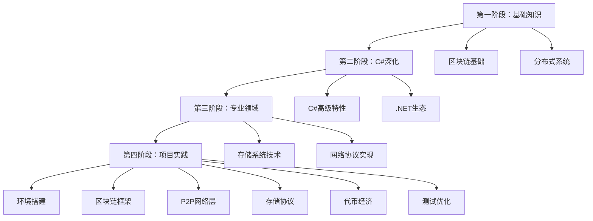

# 去中心化存储系统学习计划

## 项目概述

本项目是一个基于C#的去中心化存储区块链系统，支持代币激励和副本冗余机制，目标部署规模为10-50个节点的测试网络。

## 学习路径总览



## 第一阶段：基础知识强化 (2-3周)

### 📚 区块链基础概念学习

#### 1.1 区块链原理和分布式账本概念
- [ ] 学习区块链基本概念和定义
- [ ] 理解分布式账本技术原理
- [ ] 掌握区块链的数据结构特点
- [ ] 了解区块链的发展历程和应用场景

**推荐资源**：
- 《精通比特币》第1-3章
- 《区块链原理、设计与应用》第1-2章
- Bitcoin白皮书原文阅读

**实践任务**：
- [ ] 搭建Bitcoin测试节点
- [ ] 分析比特币区块结构
- [ ] 理解交易验证流程

#### 1.2 去中心化和不可篡改性特性
- [ ] 理解去中心化的优势和挑战
- [ ] 学习哈希链的不可篡改原理
- [ ] 掌握共识机制的作用和分类
- [ ] 了解51%攻击的原理和防护

**推荐资源**：
- 《区块链技术与应用》相关章节
- 以太坊白皮书阅读
- 共识算法对比分析文章

**实践任务**：
- [ ] 实现简单的区块链数据结构
- [ ] 验证哈希链的不可篡改性
- [ ] 模拟51%攻击场景

#### 1.3 共识算法基础（PoS和存储证明）
- [ ] 学习PoS（权益证明）机制原理
- [ ] 理解存储证明（PoSt）概念
- [ ] 掌握验证者选择算法
- [ ] 了解惩罚机制设计

**推荐资源**：
- 《共识算法：原理与实践》
- Filecoin白皮书存储证明部分
- 以太坊2.0 Casper协议文档

**实践任务**：
- [ ] 实现简单的PoS算法
- [ ] 模拟验证者选择过程
- [ ] 设计基础惩罚机制

#### 1.4 加密算法基础（哈希、数字签名、公私钥加密）
- [ ] 掌握SHA-256哈希算法原理
- [ ] 学习数字签名机制
- [ ] 理解公私钥加密体系
- [ ] 了解Merkle树结构

**推荐资源**：
- 《密码学导论》相关章节
- BouncyCastle库文档
- C#加密编程教程

**实践任务**：
- [ ] 实现SHA-256哈希计算
- [ ] 创建数字签名验证系统
- [ ] 构建Merkle树数据结构

#### 1.5 UTXO模型和交易机制
- [ ] 理解UTXO（未花费交易输出）模型
- [ ] 学习交易输入输出机制
- [ ] 掌握交易验证流程
- [ ] 了解双花防护机制

**推荐资源**：
- 《精通比特币》第5-6章
- Bitcoin交易分析工具
- UTXO模型实现案例

**实践任务**：
- [ ] 实现UTXO数据结构
- [ ] 创建交易验证系统
- [ ] 模拟双花攻击防护

### 📚 分布式系统理论学习

#### 1.6 CAP定理和分布式系统原理
- [ ] 学习CAP定理（一致性、可用性、分区容错性）
- [ ] 理解BASE理论和最终一致性
- [ ] 掌握分布式系统的挑战和解决方案
- [ ] 了解分布式事务处理

**推荐资源**：
- 《分布式系统概念与设计》
- 《数据密集型应用系统设计》
- CAP定理经典论文

**实践任务**：
- [ ] 分析不同一致性模型的适用场景
- [ ] 设计简单的分布式协调机制
- [ ] 实现最终一致性算法

#### 1.7 P2P网络基础知识
- [ ] 学习P2P网络拓扑结构
- [ ] 理解节点发现和路由机制
- [ ] 掌握DHT（分布式哈希表）原理
- [ ] 了解网络分区处理

**推荐资源**：
- 《P2P系统与应用》
- LibP2P协议文档
- Kademlia DHT算法论文

**实践任务**：
- [ ] 实现简单的P2P节点发现
- [ ] 构建基础的消息路由系统
- [ ] 模拟网络分区场景

#### 1.8 分布式存储概念和策略
- [ ] 学习数据分片和复制策略
- [ ] 理解一致性哈希算法
- [ ] 掌握冗余和容错机制
- [ ] 了解数据恢复技术

**推荐资源**：
- 《分布式存储系统设计与实现》
- Google Spanner论文
- DynamoDB架构设计文档

**实践任务**：
- [ ] 实现一致性哈希算法
- [ ] 设计数据分片策略
- [ ] 构建简单的冗余存储系统

#### 1.9 故障容错和网络分区处理
- [ ] 学习故障检测和恢复机制
- [ ] 理解网络分区的处理策略
- [ ] 掌握心跳和超时机制
- [ ] 了解拜占庭容错算法

**推荐资源**：
- 《容错系统设计》
- Paxos和Raft算法论文
- 分布式系统故障案例分析

**实践任务**：
- [ ] 实现故障检测机制
- [ ] 设计网络分区恢复策略
- [ ] 模拟拜占庭故障场景

## 第二阶段：C#专业深化 (2-3周)

### 💻 C#高级特性学习

#### 2.1 掌握async/await异步编程模式
- [ ] 理解异步编程的基本概念
- [ ] 掌握Task和Task<T>的使用
- [ ] 学习async/await语法糖
- [ ] 了解异步编程的最佳实践

**推荐资源**：
- 《C#并发编程经典实例》
- Microsoft官方异步编程文档
- .NET异步编程模式指南

**实践任务**：
- [ ] 重写同步代码为异步实现
- [ ] 实现异步的区块链操作
- [ ] 创建异步的P2P通信机制

#### 2.2 学习内存管理和性能优化技巧
- [ ] 理解.NET内存管理机制
- [ ] 学习Span<T>和Memory<T>的使用
- [ ] 掌握对象池和资源池化
- [ ] 了解GC调优技巧

**推荐资源**：
- 《C#内存管理与性能优化》
- .NET性能分析工具文档
- MemoryPool源码分析

**实践任务**：
- [ ] 优化区块链数据结构的内存使用
- [ ] 实现高效的数据序列化
- [ ] 创建网络缓冲区池

#### 2.3 深入学习网络编程（Socket、HttpClient）
- [ ] 掌握Socket编程基础
- [ ] 学习HttpClient高级用法
- [ ] 理解TCP/IP协议栈
- [ ] 了解网络编程的性能优化

**推荐资源**：
- 《C#网络编程实战》
- .NET网络编程文档
- Socket编程最佳实践

**实践任务**：
- [ ] 实现P2P网络通信基础
- [ ] 创建高效的HTTP客户端
- [ ] 设计网络协议处理框架

#### 2.4 理解并行计算和资源池化
- [ ] 学习Parallel类和PLINQ
- [ ] 掌握线程池的使用
- [ ] 理解并发集合和同步机制
- [ ] 了解锁-free编程技术

**推荐资源**：
- 《C#多线程编程实战》
- .NET并发编程文档
- 并发模式和实践案例

**实践任务**：
- [ ] 实现并行的区块验证
- [ ] 创建并行的存储验证系统
- [ ] 优化共识算法的并发性能

### 📦 .NET生态系统学习

#### 2.5 学习System.Net.Sockets网络通信
- [ ] 掌握TcpListener和TcpClient
- [ ] 学习异步Socket编程
- [ ] 理解网络流和缓冲区管理
- [ ] 了解Socket选项和配置

**推荐资源**：
- .NET Socket编程文档
- 网络编程最佳实践指南
- 高性能Socket编程案例

**实践任务**：
- [ ] 实现P2P节点通信基础
- [ ] 创建自定义网络协议
- [ ] 优化网络传输性能

#### 2.6 掌握Grpc.Net RPC服务实现
- [ ] 学习gRPC协议和Protobuf
- [ ] 掌握gRPC服务定义和实现
- [ ] 理解流式RPC和双向通信
- [ ] 了解gRPC的拦截器和中间件

**推荐资源**：
- gRPC官方文档
- .NET gRPC编程指南
- Protobuf语法和最佳实践

**实践任务**：
- [ ] 定义区块链RPC服务接口
- [ ] 实现节点间gRPC通信
- [ ] 创建流式的数据传输

#### 2.7 学习Microsoft.Extensions.Logging日志系统
- [ ] 掌握日志级别和配置
- [ ] 学习结构化日志记录
- [ ] 理解日志提供者和过滤器
- [ ] 了解性能日志和监控

**推荐资源**：
- .NET日志系统文档
- Serilog高级用法
- 日志最佳实践指南

**实践任务**：
- [ ] 配置区块链系统日志
- [ ] 实现结构化的操作日志
- [ ] 创建性能监控日志

#### 2.8 了解LevelDB.NET键值存储
- [ ] 学习LevelDB基本概念和API
- [ ] 掌握键值存储的操作模式
- [ ] 理解批量操作和事务
- [ ] 了解性能调优和配置

**推荐资源**：
- LevelDB官方文档
- LevelDB.NET使用指南
- 键值存储设计模式

**实践任务**：
- [ ] 实现区块链数据的持久化
- [ ] 创建UTXO的键值存储
- [ ] 优化存储查询性能

#### 2.9 学习BouncyCastle加密算法库
- [ ] 掌握BouncyCastle基本API
- [ ] 学习常用加密算法实现
- [ ] 理解数字签名和验证
- [ ] 了解密钥管理和安全实践

**推荐资源**：
- BouncyCastle官方文档
- C#加密编程指南
- 密码学安全最佳实践

**实践任务**：
- [ ] 实现区块链的加密功能
- [ ] 创建数字签名系统
- [ ] 构建安全的密钥管理

## 第三阶段：专业领域学习 (3-4周)

### 🗄️ 存储系统技术学习

#### 3.1 学习Reed-Solomon纠删码算法
- [ ] 理解纠删码的基本原理
- [ ] 学习Reed-Solomon数学基础
- [ ] 掌握编码和解码算法
- [ ] 了解参数选择和性能优化

**推荐资源**：
- 《纠删码原理与实践》
- Reed-Solomon算法论文
- 开源纠删码库源码分析

**实践任务**：
- [ ] 实现基础的Reed-Solomon编解码
- [ ] 创建数据分片和恢复系统
- [ ] 优化纠删码计算性能

#### 3.2 掌握Merkle树数据结构
- [ ] 理解Merkle树的构造原理
- [ ] 学习Merkle证明的生成和验证
- [ ] 掌握Merkle树的操作算法
- [ ] 了解Merkle树在区块链中的应用

**推荐资源**：
- Merkle树原论文
- 区块链数据结构分析
- Merkle树实现案例

**实践任务**：
- [ ] 实现Merkle树的构建和验证
- [ ] 创建数据完整性证明系统
- [ ] 优化Merkle树的存储和查询

#### 3.3 理解存储证明（PoSt）机制
- [ ] 学习存储证明的基本概念
- [ ] 理解时空证明的原理
- [ ] 掌握挑战-响应机制
- [ ] 了解防作弊策略

**推荐资源**：
- Filecoin存储证明论文
- PoSt协议规范文档
- 存储证明实现分析

**实践任务**：
- [ ] 实现基础的存储证明算法
- [ ] 创建挑战生成和验证系统
- [ ] 设计防作弊的证明机制

#### 3.4 学习数据分片和分布式存储策略
- [ ] 理解数据分片的基本策略
- [ ] 学习分片算法和负载均衡
- [ ] 掌握副本管理和一致性
- [ ] 了解数据恢复和修复机制

**推荐资源**：
- 《分布式存储系统设计》
- 数据分片算法论文
- 分布式存储最佳实践

**实践任务**：
- [ ] 实现数据分片算法
- [ ] 创建副本管理系统
- [ ] 构建数据恢复机制

### 🌐 网络协议实现学习

#### 3.5 学习LibP2P.NET节点发现机制
- [ ] 理解LibP2P架构和组件
- [ ] 学习节点发现协议（mDNS、DHT）
- [ ] 掌握身份认证和加密
- [ ] 了解网络拓扑管理

**推荐资源**：
- LibP2P官方文档
- LibP2P.NET使用指南
- P2P网络协议分析

**实践任务**：
- [ ] 实现LibP2P节点发现
- [ ] 创建安全的节点通信
- [ ] 构建网络拓扑管理系统

#### 3.6 掌握消息路由和广播协议
- [ ] 学习消息路由算法
- [ ] 理解广播和组播机制
- [ ] 掌握消息队列和缓冲
- [ ] 了解网络拥塞控制

**推荐资源**：
- 网络路由协议文档
- 消息传递系统设计
- P2P广播算法论文

**实践任务**：
- [ ] 实现高效的消息路由
- [ ] 创建可靠的消息广播
- [ ] 构建网络拥塞控制机制

#### 3.7 理解安全通信和TLS加密
- [ ] 学习TLS/SSL协议原理
- [ ] 掌握证书管理和验证
- [ ] 理解端到端加密
- [ ] 了解安全通信最佳实践

**推荐资源**：
- TLS协议规范文档
- .NET安全编程指南
- 网络安全最佳实践

**实践任务**：
- [ ] 实现TLS加密的P2P通信
- [ ] 创建证书管理系统
- [ ] 构建安全的数据传输通道

#### 3.8 学习网络拓扑管理
- [ ] 理解网络拓扑结构类型
- [ ] 学习拓扑发现和维护
- [ ] 掌握节点选择和路由优化
- [ ] 了解网络分区和恢复

**推荐资源**：
- 网络拓扑管理论文
- P2P网络优化算法
- 分布式网络设计模式

**实践任务**：
- [ ] 实现网络拓扑发现
- [ ] 创建智能的节点选择
- [ ] 构建网络分区恢复机制

## 第四阶段：项目实践 (持续进行)

### 🛠️ 项目实践准备

#### 4.1 搭建开发环境（.NET 8 SDK、IDE）
- [ ] 安装.NET 8 SDK和运行时
- [ ] 配置Visual Studio 2022或VS Code
- [ ] 安装必要的扩展和工具
- [ ] 配置Git版本控制

**推荐资源**：
- .NET 8官方安装指南
- VS Code C#扩展配置
- Git基础教程

**实践任务**：
- [ ] 创建.NET 8项目模板
- [ ] 配置开发环境调试
- [ ] 建立代码仓库和分支策略

#### 4.2 创建项目基础结构
- [ ] 设计项目目录结构
- [ ] 创建解决方案和项目文件
- [ ] 配置项目引用和依赖
- [ ] 建立代码规范和格式化

**推荐资源**：
- .NET项目结构最佳实践
- C#代码规范指南
- 项目组织模式

**实践任务**：
- [ ] 创建DecentralizedStorage解决方案
- [ ] 建立Core、Network、Storage等项目
- [ ] 配置项目间的依赖关系

#### 4.3 配置必要的NuGet包依赖
- [ ] 添加核心依赖包（日志、配置等）
- [ ] 配置网络通信相关包
- [ ] 添加加密和存储库
- [ ] 配置测试和Mock框架

**推荐资源**：
- NuGet包管理指南
- .NET生态系统包推荐
- 依赖注入配置

**实践任务**：
- [ ] 配置Microsoft.Extensions包
- [ ] 添加Grpc.Net和LevelDB.NET
- [ ] 集成BouncyCastle和测试框架

#### 4.4 建立测试框架和CI/CD流程
- [ ] 配置单元测试框架（xUnit）
- [ ] 设置集成测试环境
- [ ] 建立代码覆盖率检查
- [ ] 配置自动化构建和部署

**推荐资源**：
- .NET测试最佳实践
- GitHub Actions配置指南
- 持续集成设计模式

**实践任务**：
- [ ] 创建测试项目和测试用例
- [ ] 配置GitHub Actions工作流
- [ ] 建立代码质量检查流程

### ⛓️ 区块链基础框架实现

#### 4.5 实现Block区块结构
- [ ] 定义Block数据模型
- [ ] 实现区块哈希计算
- [ ] 添加区块验证逻辑
- [ ] 创建区块序列化功能

**参考实现**：
```csharp
public class Block
{
    public int Index { get; set; }
    public string Hash { get; set; }
    public string PreviousHash { get; set; }
    public long Timestamp { get; set; }
    public List<Transaction> Transactions { get; set; }
    public string Validator { get; set; }
    public string Signature { get; set; }
    public long Nonce { get; set; }
    
    public string CalculateHash()
    {
        var blockData = $"{Index}{PreviousHash}{Timestamp}{string.Join("", Transactions.Select(t => t.Hash))}{Validator}{Nonce}";
        return HashHelper.ComputeSHA256(blockData);
    }
}
```

#### 4.6 实现Transaction交易结构
- [ ] 定义Transaction数据模型
- [ ] 实现交易类型枚举
- [ ] 添加交易验证逻辑
- [ ] 创建交易签名功能

**参考实现**：
```csharp
public enum TransactionType
{
    Storage,    // 存储交易
    Challenge,  // 挑战交易
    Reward,     // 奖励交易
    Transfer    // 转账交易
}

public class Transaction
{
    public string Id { get; set; }
    public TransactionType Type { get; set; }
    public string From { get; set; }
    public string To { get; set; }
    public long Amount { get; set; }
    public long Fee { get; set; }
    public long Timestamp { get; set; }
    public string Data { get; set; }
    public string Signature { get; set; }
}
```

#### 4.7 创建Blockchain区块链管理类
- [ ] 实现区块链数据结构
- [ ] 添加区块添加和验证
- [ ] 创建创世区块生成
- [ ] 实现区块链查询功能

**参考实现**：
```csharp
public class Blockchain
{
    private List<Block> _chain;
    private Dictionary<string, UTXO> _utxos;
    private readonly IConsensus _consensus;
    
    public Blockchain(IConsensus consensus)
    {
        _chain = new List<Block>();
        _utxos = new Dictionary<string, UTXO>();
        _consensus = consensus;
        CreateGenesisBlock();
    }
    
    public Block GetLatestBlock() => _chain.LastOrDefault();
    public bool AddBlock(Block block) => _consensus.ValidateBlock(block, GetLatestBlock());
}
```

#### 4.8 实现基础的UTXO管理
- [ ] 定义UTXO数据结构
- [ ] 实现UTXO创建和消费
- [ ] 添加余额计算功能
- [ ] 创建交易验证逻辑

### 🌐 P2P网络层实现

#### 4.9 实现P2PNode节点核心
- [ ] 创建P2P节点基础类
- [ ] 实现节点启动和监听
- [ ] 添加连接管理和维护
- [ ] 创建消息处理框架

**参考实现**：
```csharp
public class P2PNode
{
    private readonly string _nodeId;
    private readonly IPEndPoint _listenAddress;
    private readonly Dictionary<string, PeerConnection> _peers;
    
    public async Task StartAsync()
    {
        var listener = new TcpListener(_listenAddress);
        listener.Start();
        
        while (true)
        {
            var client = await listener.AcceptTcpClientAsync();
            _ = HandleConnectionAsync(client);
        }
    }
}
```

#### 4.10 创建节点发现机制
- [ ] 实现mDNS节点发现
- [ ] 添加DHT路由功能
- [ ] 创建引导节点连接
- [ ] 实现节点健康检查

#### 4.11 实现消息处理和路由
- [ ] 定义网络消息格式
- [ ] 实现消息序列化
- [ ] 添加消息路由逻辑
- [ ] 创建消息广播机制

#### 4.12 建立网络通信协议
- [ ] 设计P2P通信协议
- [ ] 实现消息类型定义
- [ ] 添加协议版本管理
- [ ] 创建协议兼容性检查

### 🗄️ 存储协议实现

#### 4.13 实现数据分片功能
- [ ] 创建数据分片算法
- [ ] 实现分片元数据管理
- [ ] 添加分片完整性检查
- [ ] 创建分片重组功能

**参考实现**：
```csharp
public class DataShard
{
    public string Id { get; set; }
    public int Index { get; set; }
    public byte[] Data { get; set; }
    public string Hash { get; set; }
    public int Size { get; set; }
    
    public static List<DataShard> CreateShards(byte[] data, int shardSize = 1024 * 1024)
    {
        var shards = new List<DataShard>();
        var totalShards = (int)Math.Ceiling((double)data.Length / shardSize);
        
        for (int i = 0; i < totalShards; i++)
        {
            var startIndex = i * shardSize;
            var length = Math.Min(shardSize, data.Length - startIndex);
            var shardData = new byte[length];
            Array.Copy(data, startIndex, shardData, 0, length);
            
            shards.Add(new DataShard
            {
                Id = Guid.NewGuid().ToString(),
                Index = i,
                Data = shardData,
                Hash = HashHelper.ComputeSHA256(shardData),
                Size = length
            });
        }
        
        return shards;
    }
}
```

#### 4.14 创建纠删码算法
- [ ] 实现Reed-Solomon编解码
- [ ] 添加校验码生成
- [ ] 创建数据恢复逻辑
- [ ] 优化编解码性能

#### 4.15 实现存储证明机制
- [ ] 创建挑战生成算法
- [ ] 实现证明生成和验证
- [ ] 添加随机抽样机制
- [ ] 创建防作弊检查

**参考实现**：
```csharp
public class StorageProof
{
    public string ChallengeId { get; set; }
    public string NodeId { get; set; }
    public string ShardId { get; set; }
    public int ChallengeIndex { get; set; }
    public string Proof { get; set; }
    
    public static StorageProof GenerateChallenge(string nodeId, string shardId)
    {
        var random = new Random();
        var challengeIndex = random.Next(0, 1000);
        
        return new StorageProof
        {
            ChallengeId = Guid.NewGuid().ToString(),
            NodeId = nodeId,
            ShardId = shardId,
            ChallengeIndex = challengeIndex,
            Timestamp = DateTimeOffset.UtcNow.ToUnixTimeSeconds()
        };
    }
}
```

#### 4.16 建立数据恢复流程
- [ ] 实现数据完整性检查
- [ ] 创建损坏分片检测
- [ ] 添加自动数据修复
- [ ] 实现数据重组算法

### 💰 代币经济模型实现

#### 4.17 创建Token代币定义
- [ ] 定义代币数据结构
- [ ] 实现代币发行和销毁
- [ ] 添加转账和余额管理
- [ ] 创建代币查询功能

**参考实现**：
```csharp
public class Token
{
    public string Symbol { get; } = "DST";
    public string Name { get; } = "Decentralized Storage Token";
    public decimal TotalSupply { get; private set; }
    public decimal CirculatingSupply { get; private set; }
    
    private readonly Dictionary<string, decimal> _balances;
    
    public bool Transfer(string from, string to, decimal amount)
    {
        if (_balances.GetValueOrDefault(from, 0) < amount)
            return false;
            
        _balances[from] -= amount;
        _balances[to] = _balances.GetValueOrDefault(to, 0) + amount;
        return true;
    }
}
```

#### 4.18 实现奖励计算系统
- [ ] 创建存储奖励算法
- [ ] 实现验证者奖励计算
- [ ] 添加奖励分发机制
- [ ] 创建奖励历史记录

#### 4.19 建立惩罚机制
- [ ] 定义惩罚类型和条件
- [ ] 实现惩罚计算逻辑
- [ ] 添加惩罚执行机制
- [ ] 创建惩罚申诉流程

#### 4.20 完善经济模型平衡
- [ ] 实现通胀/通缩控制
- [ ] 添加动态调整机制
- [ ] 创建经济参数配置
- [ ] 实现经济模型监控

### 🧪 测试和优化

#### 4.21 编写单元测试
- [ ] 为核心组件编写单元测试
- [ ] 创建测试数据和Mock对象
- [ ] 实现测试覆盖率检查
- [ ] 添加性能基准测试

#### 4.22 进行集成测试
- [ ] 创建多节点测试环境
- [ ] 实现端到端测试场景
- [ ] 添加网络分区测试
- [ ] 创建压力测试用例

#### 4.23 性能测试和优化
- [ ] 进行性能基准测试
- [ ] 识别性能瓶颈
- [ ] 优化关键路径代码
- [ ] 实现缓存和批处理优化

#### 4.24 部署测试网络验证
- [ ] 部署多节点测试网络
- [ ] 验证网络稳定性
- [ ] 测试数据存储和检索
- [ ] 验证代币经济机制

## 学习时间安排

### 总体时间规划
- **第一阶段**：2-3周（基础知识强化）
- **第二阶段**：2-3周（C#专业深化）
- **第三阶段**：3-4周（专业领域学习）
- **第四阶段**：持续进行（项目实践）

### 每周学习建议
- **理论学习**：15-20小时
- **实践编码**：10-15小时
- **阅读资料**：5-10小时
- **总结反思**：2-3小时

### 里程碑检查点
1. **第3周**：完成区块链和分布式系统基础学习
2. **第6周**：掌握C#高级特性和.NET生态
3. **第10周**：理解存储系统和网络协议
4. **第14周**：完成项目基础框架实现
5. **第18周**：完成P2P网络和存储协议
6. **第22周**：完成代币经济和测试优化

## 学习资源推荐

### 📚 必读书籍
1. 《精通比特币》- Andreas M. Antonopoulos
2. 《区块链原理、设计与应用》- 邹均等
3. 《分布式系统概念与设计》- George Coulouris
4. 《C#并发编程经典实例》- Stephen Cleary
5. 《数据密集型应用系统设计》- Martin Kleppmann

### 🌐 在线资源
1. **Microsoft Learn** - .NET官方学习平台
2. **CryptoZombies** - 区块链交互式教程
3. **LibP2P文档** - P2P网络协议官方文档
4. **Filecoin文档** - 存储证明实现参考
5. **GitHub开源项目** - 实际代码学习

### 🎓 视频课程
1. **Coursera - Blockchain Basics**
2. **Udemy - Advanced C# Programming**
3. **edX - Distributed Systems**
4. **YouTube - .NET Core tutorials**
5. **Bilibili - 区块链技术分享**

### 🛠️ 实践平台
1. **GitHub** - 代码托管和协作
2. **Docker Hub** - 容器镜像管理
3. **Azure/AWS** - 云服务部署
4. **TestNet** - 区块链测试网络
5. **LocalStack** - 本地开发环境

## 学习建议和注意事项

### 🎯 学习策略
1. **理论与实践结合**：每学完一个概念立即动手实现
2. **循序渐进**：从简单到复杂，逐步构建完整系统
3. **问题导向**：带着实际问题去学习和探索
4. **持续迭代**：不断优化和改进实现方案

### ⚠️ 常见陷阱
1. **过度理论化**：避免只学理论不实践
2. **完美主义**：不要追求一次性完美实现
3. **孤立学习**：积极参与社区讨论和交流
4. **缺乏规划**：制定明确的学习目标和时间表

### 🤝 社区参与
1. **GitHub贡献**：参与相关开源项目
2. **技术博客**：分享学习心得和实现经验
3. **技术论坛**：参与Stack Overflow等社区讨论
4. **线下活动**：参加技术meetup和conference

### 📈 进阶方向
1. **深入研究**：选择特定领域深入钻研
2. **性能优化**：专注于系统性能和可扩展性
3. **安全加固**：学习区块链安全和攻防技术
4. **商业应用**：探索区块链在实际业务中的应用

## 成功标准

### 🎯 技术能力目标
- [ ] 独立实现区块链核心功能
- [ ] 构建稳定的P2P网络通信
- [ ] 实现可靠的分布式存储系统
- [ ] 设计合理的代币经济模型

### 📊 项目成果目标
- [ ] 完成10-50节点测试网络部署
- [ ] 实现数据上传下载延迟 < 5秒
- [ ] 达到网络可用性 > 95%
- [ ] 确保存储验证准确率 > 99%

### 🏆 个人成长目标
- [ ] 掌握区块链和分布式系统核心技术
- [ ] 提升C#高级编程和系统设计能力
- [ ] 建立技术影响力和开源项目贡献
- [ ] 为职业发展增加竞争力

---

**祝您学习顺利！这个项目虽然挑战很大，但学习价值极高，坚持下去一定会有丰厚的回报！** 🚀