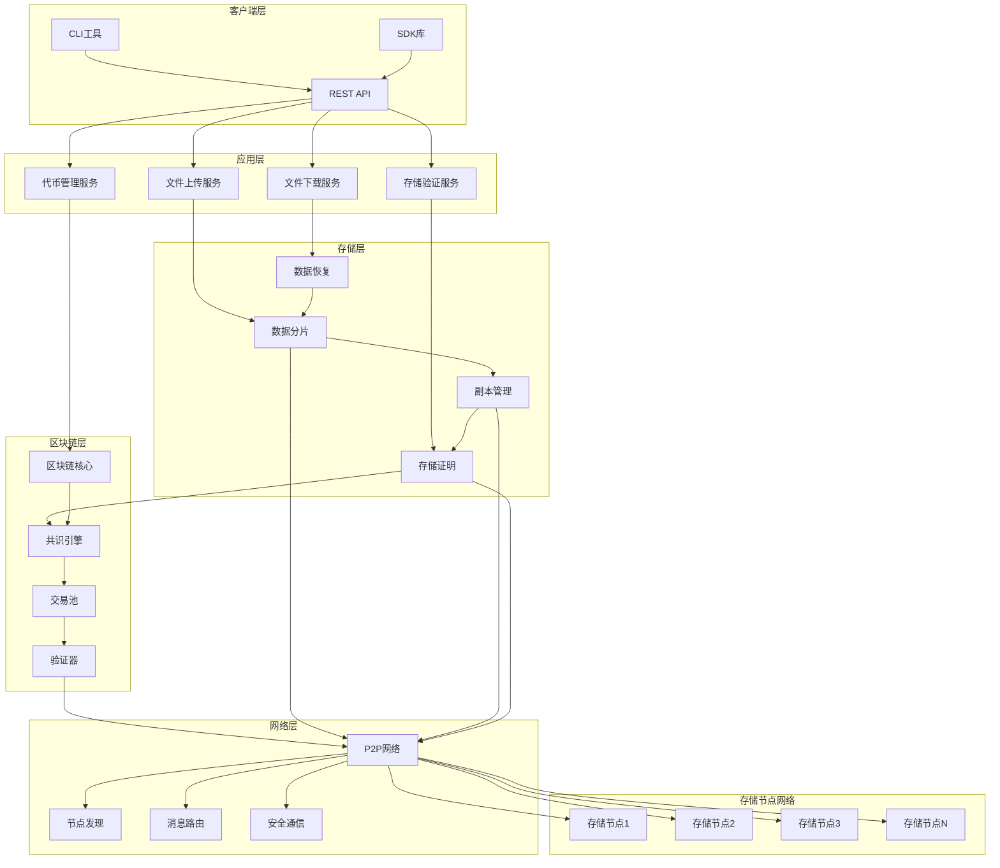
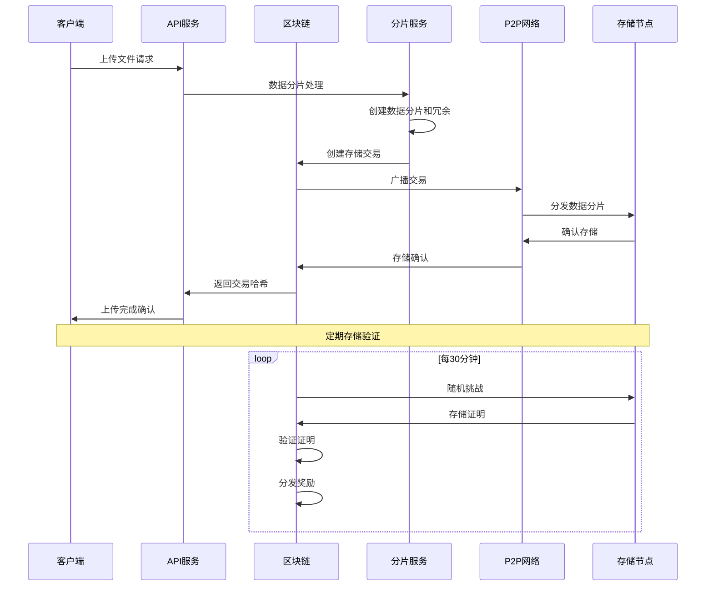
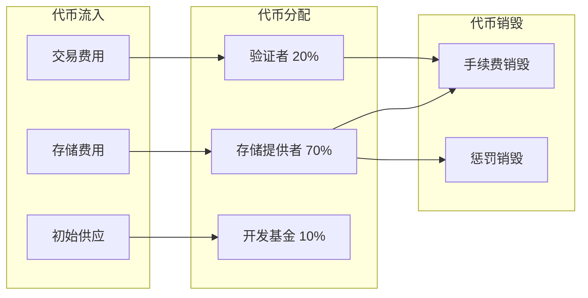
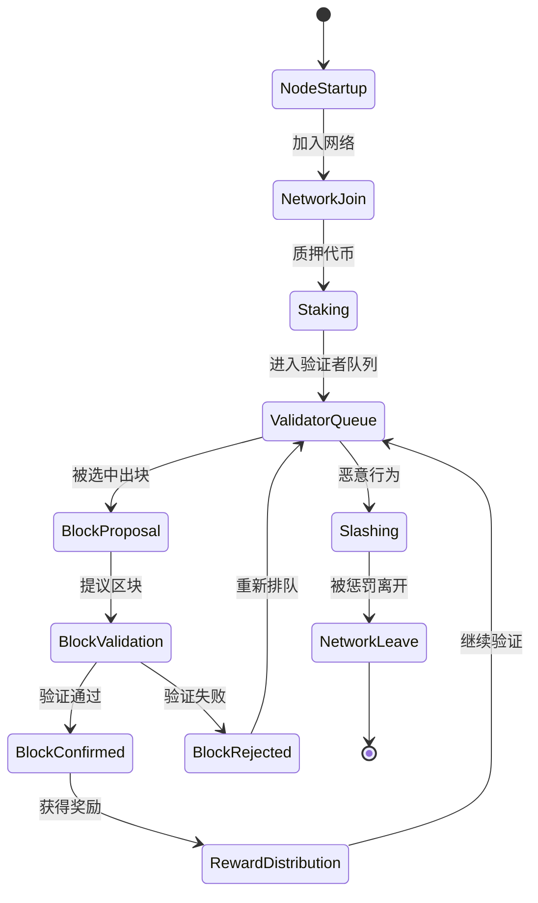
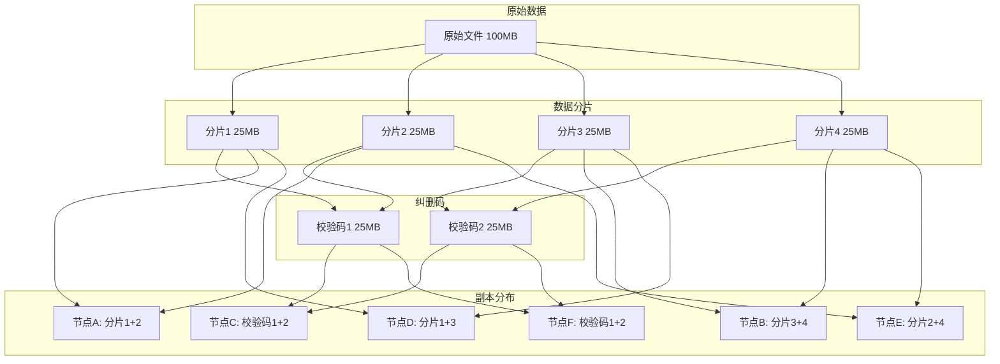

# 去中心化存储系统架构图

## 整体系统架构



## 数据流架构



## 代币经济模型



## 共识机制流程



## 存储冗余策略



## 技术栈架构

```mermaid
graph TB
    subgraph "前端技术"
        CSharp[C# .NET 8]
        ASPNET[ASP.NET Core]
        GRPC[gRPC]
    end
    
    subgraph "网络通信"
        LibP2P[LibP2P.NET]
        WebSocket[WebSocket]
        HTTP[HTTP/HTTPS]
    end
    
    subgraph "数据存储"
        LevelDB[LevelDB.NET]
        SQLite[SQLite]
        MemoryCache[内存缓存]
    end
    
    subgraph "加密算法"
        AES[AES-256]
        RSA[RSA-4096]
        SHA[SHA-256]
        ECDSA[ECDSA]
    end
    
    subgraph "序列化"
        MessagePack[MessagePack]
        Protobuf[Protocol Buffers]
        JSON[JSON.NET]
    end
    
    CSharp --> ASPNET
    CSharp --> GRPC
    ASPNET --> HTTP
    GRPC --> LibP2P
    LibP2P --> WebSocket
    
    CSharp --> LevelDB
    CSharp --> SQLite
    CSharp --> MemoryCache
    
    CSharp --> AES
    CSharp --> RSA
    CSharp --> SHA
    CSharp --> ECDSA
    
    CSharp --> MessagePack
    CSharp --> Protobuf
    CSharp --> JSON